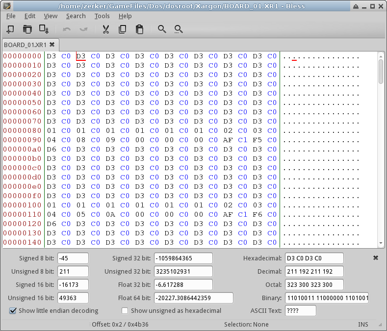
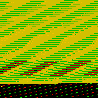
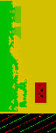
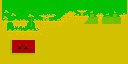

# Day 1 #

After finishing ROTT and the Shadow Caster maps, I decided to tackle
something much simpler, but also to document the process as I go along.
That game is Xargon, which can be obtained at [Classic Dos
Games](http://www.classicdosgames.com/game/Xargon.html).
According to that site, Allen Pilgrim released the full version
available as freeware with a very short license, so we will be able to
map all three episodes. However, since I already have it on my computer,
I will start with Episode 1. Note that the Source Code is released, so
that is an option if I get stuck. However, to hopefuly make this
tutorial more useful (and fun), I'm planning to do this as a black-box
exercise. Obviously, if the game has a source code release, or is well
documented, that can help reduce the guesswork.

As with Shadow Caster and ROTT, I will be using
[Python](http://www.python.org/) and the [Python Imaging
Library (PIL)](http://www.pythonware.com/index.htm). I will
also need a Hex editor to look through the game resources before digging
in, so [Bless](http://home.gna.org/bless/) is my editor of
choice. Windows users will obviously need something else.

Generally speaking, creating a map via hacking is composed of three
phases:

Phase 1: Figure out the map format 
Phase 2: Figure out the image data format(s) 
Phase 3: Put it all together and make the map (this the real meat of
it)

Phases 1 and 2 can be done in either order, but I will start in the
order above.

So, the map format. Xargon is split into a number of different files,
and I'm going to take a wild guess that the BOARD_##.XR1 files are
the maps. Let's look at one in a hex editor:



The first thing to notice is there's definately a repeating pattern.
The second thing is that it looks like a 16 bit pattern. This can mean
either 2 individual bytes per location, or a single 16 bit number per
location. Either way, we know the size of a location, but not the
dimensions of the map. We also know that there is no header, because the
pattern starts immediately at the top of the file. Given the nature of
the game, we will start with the assumption that the game map is simply
a direct listing of tiles without any grouping, compression or other
tricks. So, let's take the file size and figure out how many tiles we
have total:

19255 bytes / 2 = 9627.5. This already tells us that we must have some
sort of footer that isn't part of the map data. Scrolling down to the
bottom of the file confirms this, as the map ends in the string "TOO
LATE TO TURN BACK!". However, the footer is unlikely to be a huge
portion of the file, so let's ignore it for now. Taking the square root
of the file size gives us the dimensions if the game used square levels:
98.11. This gives us an order-of-magnitude to guess for. I know that the
maps aren't square, but let's run with this and see where it gets us.

The next step is to visualize the map to see if we guessed correctly.
8-bit numbers are easiest, as we can go direct to grayscale. 16 bit
numbers present us with two options: if we think the numbers present
different information, we can try two parallel grayscale images. If we
think it's just one 16 bit tile number, we should just pick two out of
the three RGB channels and generate a colour image.  I'm going with the
latter option initially. I'm also going to cheat a little bit and copy
some boilerplate code from my other scripts as far as grabbing the input
file and checking for # of input parameters. Here's the basic
visualizer script:


```py
import struct, sys
from PIL import Image

if __name__ == "__main__":
    if len(sys.argv) < 2:
        print """Usage: python xargonmap.py [Map File]
TODO
"""
    else:
        for filename in sys.argv[1:]:
            mapfile = open(filename, 'rb')
            outname = filename + '.png'

            # Load the map data as a 98 x 98 array of 2-byte positions:
            # This will be switched to proper 16 bit numbers when we
            # actually want to start generating the tile map.
            # struct
            pattern = '<{}B'.format(98*98*2)

            mapdata = struct.unpack(pattern,
                mapfile.read(struct.calcsize(pattern)) )
            mapfile.close()

            # Turn the map data into a list of 3-byte tuples to visualize it.
            # Start by pre-creating an empty list of zeroes then copy it in
            visualdata = [None] * (98*98)
            for index in range(98*98):
                visualdata[index] = (mapdata[index * 2], mapdata[index * 2 + 1], 0)

            # Tell PIL to interpret the map data as a RAW image:
            mapimage = Image.new("RGB", (98, 98) )
            mapimage.putdata(visualdata)
            mapimage.save(outname)
```


'<{}B' means a little endian pattern of {} bytes, where the actual 
number is filled in by the format call. Refer to the [Python Struct 
module documention](http://docs.python.org/2/library/struct.html) for 
more information on these strings.

So we run it and get:



That's cute. Obviously wrong too, but there's a clear pattern shift to
the image. We should be able to figure out exactly how far we are off on
each row. Opening in GIMP and counting the pixel shift shows that we
appear to repeat every 64 pixels. Taking our original dimensions, and
using 64 as one dimension yields 9627.5/64 = 150.4 for the other. Some
of that is going to be footer, but we should be able to clearly see the
breakdown when we finish. Our adjusted script becomes:

```py
import struct, sys
from PIL import Image

if __name__ == "__main__":
    if len(sys.argv) < 2:
        print """Usage: python xargonmap.py [Map File]
TODO
"""
    else:
        for filename in sys.argv[1:]:
            mapfile = open(filename, 'rb')
            outname = filename + '.png'

            # Load the map data as a 98 x 98 array of 2-byte positions:
            # This will be switched to proper 16 bit numbers when we
            # actually want to start generating the tile map.
            # struct
            pattern = '<{}B'.format(64*150*2)

            mapdata = struct.unpack(pattern,
                mapfile.read(struct.calcsize(pattern)) )
            mapfile.close()

            # Turn the map data into a list of 3-byte tuples to visualize it.
            # Start by pre-creating an empty list of zeroes then copy it in
            visualdata = [None] * (64*150)
            for index in range(64*150):
                visualdata[index] = (mapdata[index * 2], mapdata[index * 2 + 1], 0)

            # Tell PIL to interpret the map data as a RAW image:
            mapimage = Image.new("RGB", (64, 150) )
            mapimage.putdata(visualdata)
            mapimage.save(outname)
```


Yeilding:



That looks WAY better. But it looks sideways. And we can clearly see the
garbage at the bottom is the footer and is not tile data (we'll have to
figure it out later; I suspect it is item/monster placement). Opening in
GIMP again shows that the map is only 128 pixels tall, so let's fix
that dimension. Let's also rotate it -90 degrees.


```py
import struct, sys
from PIL import Image

if __name__ == "__main__":
    if len(sys.argv) < 2:
        print """Usage: python xargonmap.py [Map File]
TODO
"""
    else:
        for filename in sys.argv[1:]:
            mapfile = open(filename, 'rb')
            outname = filename + '.png'

            # Load the map data as a 98 x 98 array of 2-byte positions:
            # This will be switched to proper 16 bit numbers when we
            # actually want to start generating the tile map.
            # struct
            pattern = '<{}B'.format(64*128*2)

            mapdata = struct.unpack(pattern,
                mapfile.read(struct.calcsize(pattern)) )
            mapfile.close()

            # Turn the map data into a list of 3-byte tuples to visualize it.
            # Start by pre-creating an empty list of zeroes then copy it in
            visualdata = [None] * (64*128)
            for index in range(64*128):
                visualdata[index] = (mapdata[index * 2], mapdata[index * 2 + 1], 0)

            # Tell PIL to interpret the map data as a RAW image:
            mapimage = Image.new("RGB", (64, 128) )
            mapimage.putdata(visualdata)
            mapimage.rotate(-90).save(outname)
```


And the final result (for today) is:


