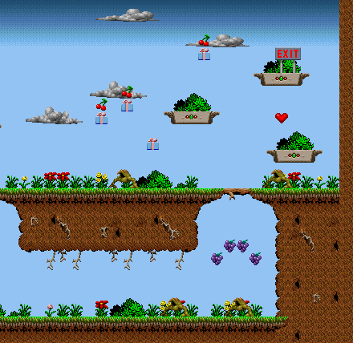
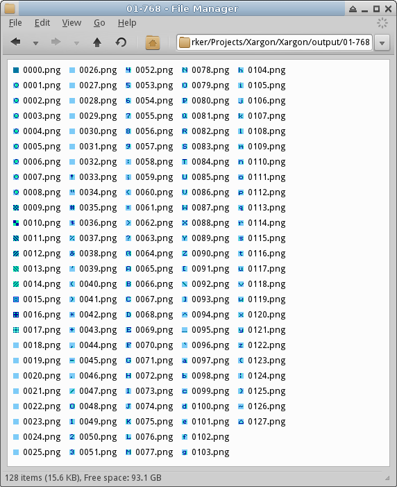
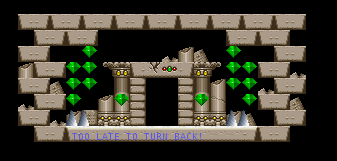
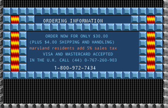
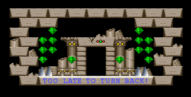

# Day 10 #

Good evening. Time to tackle the two enhancements we wanted yesterday. 
Enhancement #1 is for present contents. For these I'm just going to 
expand the capabilities of the basic sprite class and not even make a 
separate class. I will simply add an optional parameter for the content 
sprite. When drawing the sprite, if contents are assigned, they will be 
drawn immediately above the sprite itself.

```py
class sprite(object):
    def __init__(self, image, xoffs=0, yoffs=0, contents=None):
        self.image = image
        self.xoffs = xoffs
        self.yoffs = yoffs
        self.contents = contents

    def draw(self, mappicture, objrec):
        # When pasting masked images, need to specify the mask for the paste.
        # RGBA images can be used as their own masks.
        mappicture.paste(self.image, (objrec.x +self.xoffs,
            objrec.y +self.yoffs), self.image)

        if contents != None:
            # Place contents immediately above the current sprite
            mappicture.paste(self.contents, (objrec.x +self.xoffs,
                objrec.y +self.yoffs - self.contents.size[1]), self.contents)
```

And minor changes to the database:

```py
# Presents have contents:
for (sprtype, subtype, recnum, imagenum, crecnum, cimagenum) in [
        (26, 2, 37, 27, 37, 6), # Treasure (Cherry)
        (26, 0, 37, 27, 37, 33) # Treasure (Health)
        ]:
    self.addsprite(sprtype, subtype, sprite(graphics.records[recnum].images[imagenum],
        contents=graphics.records[crecnum].images[cimagenum]))
```



That was easy. Now for text. There are two approaches we can use for 
text:

1) Use the raw text images we have to reproduce the in-game text
2) Find a close match and just go with it

That said, what we got directly out of the reference file appears a bit 
strange and would need some post-processing to get it to appear 
correct. The second option is certainly simpler, and I will go with 
that for now. As long as I can find a fixed-width font with reasonably 
similar weight and size, it should be pretty equivalent. For reference, 
here is the direct font data from the GRAPHICS file:



Stage 1 is easy, but we need to figure out the general solution for 
picking the correct text string. For that, we will refer to stages 3 
and 33 (aka the ending).

Let me include the records for object 7 from each stage together below 
(stage # is the first column). I will also number the columns from the 
original file as a zero-based index along top.

```
    0   1       2   3   4   5   6   7   8   9   10  11  12  13  14  15  16
1   7   1584    788 9   -1  184 8   0   0   0   0   0   4   55  68  0   0
3   7   1824    560 6   -1  112 8   0   0   0   0   0   4   95  72  0   0
3   7   1856    576 6   -1  32  8   0   0   0   0   0   4   94  72  0   0
33  7   1104    36  7   -1  160 8   0   0   0   0   0   4   71  72  0   0
33  7   1440    36  7   -1  160 8   0   0   0   0   0   4   69  72  0   0
33  7   1120    130 7   -1  120 8   0   0   0   0   0   4   55  72  0   0
33  7   1456    130 7   -1  120 8   0   0   0   0   0   4   44  72  0   0
33  7   112     484 7   -1  136 8   0   0   0   0   0   4   31  72  0   0
33  7   112     578 7   -1  120 8   0   0   0   0   0   4   25  72  0   0
33  7   144     708 7   -1  56  8   0   0   0   0   0   4   24  72  0   0
33  7   80      48  6   -1  176 8   0   0   0   0   0   4   5   72  0   0
33  7   112     64  6   -1  112 8   0   0   0   0   0   4   3   72  0   0
33  7   112     96  7   -1  112 8   0   0   0   0   0   4   1   72  0   0
33  7   512     820 8   -1  120 8   0   0   0   0   0   4   250 71  0   0
```

We've already identified indices 0 to 2 and 5 - 7, although the obvious 
choice of the subtype does not appear to be used to select the specific 
string to be displayed. The only one that appears different for each 
string is column 13, but that doesn't make much sense on its own. That 
said, I think column 3 might be the colour index, of the first 16 
colours in the palette. 9 is blue, 7 is white, 6 is yellow, 8 is dark 
gray.

Hrm, giving it a bit more of a look, it's possible that it might be 
part of a 16-bit number. The wrap around from ``1 72`` to ``250 71`` seems to 
imply that. Let me fix my decoding and try again. Here are just the 
numbers, (+ some in hex)

```
1   17463   0x4437
3   18527   0x485F
3   18526   0x485E
33  18503
33  18501
33  18487
33  18476
33  18463
33  18457
33  18456
33  18437
33  18435
33  18433
33  18426
```

I don't get it. I'm just going to have to hack something together. The 
ONLY pattern I think I can figure out is that these numbers are 
decreasing compared to the order of the strings. I also noticed that 
apparently object #17 also uses strings, as does object 6. Object 17 
appears to be for internal use, so I won't actually draw those, but 
object 6 appears to be another string region (different font maybe?). 
Either way, here's what my hacked up approach will be:

1) Look for all numbers in this column, and collect them in a list in 
   descending order.
2) When I have a string to grab, I will pull the string that 
   corresponds to the order within the strings array corresponding to this 
   number.

That should work for maps 1 and 3, but I have no idea how well it will 
sort itself out for map 33. At least it will get us un-stuck for now. 
First, let's add the new fields to the record:

```py
class objrecord(object):
    def __init__(self, record):
        self.rawdata = record
        (self.sprtype, self.x, self.y, self.colour) = record[0:4]
        (self.width, self.height, self.subtype) = record[5:8]
        self.stringref = record[13]
```

Now, let's get that lookup table implemented:

```py
# String reference lookup table. This is a bit of a hack for now.
# Sort all known string references in reverse order:
self.stringlookup = [record.stringref for record in self.objs if record.stringref > 0]
self.stringlookup.sort(reverse=True)
```

And a lookup method to get the correct string:

```py
def getstring(self, stringref):
    strindex = self.stringlookup.index(stringref)
    return self.strings[strindex]
```

To get the right text colour, I will need a palette lookup method for 
the graphics object:

```py
def getcolour(self, index):
    return tuple(self.palette[index*3:index*3+3])
```

To be able to do the text lookup, I need to pass a reference to the map 
into my sprite draw routine. Then I need to actually write the text 
sprite class to take advantage of all this new infrastructure. For the 
font, I'll just go with DroidSansMono for now. I'll pick 10 point font 
for object 7 and 8 point font for object 6. Here's how the text sprite 
class ended up:

```py
class textsprite(sprite):
    def __init__(self, font, graphics):
        self.font = font
        self.graphics = graphics

    def draw(self, mappicture, objrec, mapdata):
        pen = ImageDraw.Draw(mappicture)
        pen.text((objrec.x, objrec.y), mapdata.getstring(objrec.stringref),
                font=self.font, fill=self.graphics.getcolour(objrec.colour))
```

More importantly, it works!



And even works for Board 33!



But the font is a bit too thin. Let me see if I can find a monospaced 
font that has a dedicated bold version. I'll also tweak the alignment a 
bit.

Here's FreeMonoBold, with a bit larger size. It'll do for a while. It's 
not that great, so I think we will want to get some handling for the 
ingame font. But that can wait now that we have the actual text display 
working nicely.



Now on to identifying items. Stage 1 is done, so stage 2 is next.

But it looks like we hit a snag on level 2. There is a centipede 
monster in this stage, which is stored as a series of segments in the 
graphics file, so we can't just draw a single sprite. We need a method 
for creating a compound image to draw him properly. Also, sprite 73 
appears to be a hidden pickup. We will want to indicate these some way 
(i.e. by making them semi-transparent, probably). I will tackle all 
this tomorrow. Both cases should be just a matter of pre-processing the 
images before creating the corresponding sprite object and shouldn't 
require their own types of sprites.

[day10.zip][day10] is available.

[day10]: http://www.zerker.ca/misc/xargon/day9.zip
