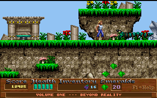
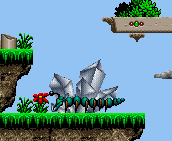
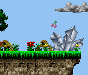
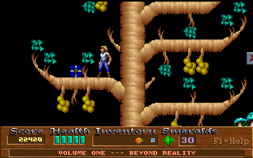
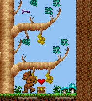
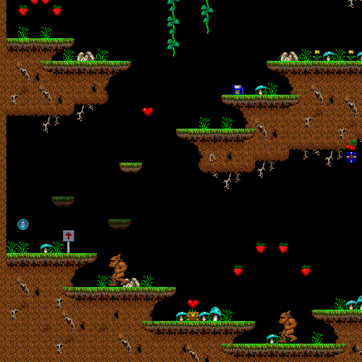

# Day 11 #

Today I'm going to handle the slightly more complicated sprites we want 
to handle. First, here's a screenshot of the centipede monster we want 
to re-create from the individual segment sprites:



I count a head, six segments, then a tail. The map data tells me that 
the bounding box is 76 x 22, although the actual sprite dimensions vary 
from 16x20 (head) to 8x17 (segment) to 12x8 (tail). However, each 
segment appears to connect directly to the next with no padding on the 
sprite image itself, so that will make things easy. Adding up the 
required widths adds up to exactly 76, so there's some additional 
confirmation. Let's make up a method for making a composite sprite. I'm 
adding this to the graphics file, since it owns the original images. It 
could have also been added to the spritedb file, but it would need a 
copy of the graphics file, so that seems somewhat silly.

```py
def compositeimage(self, dimensions, imgrequests):
    tempimage = Image.new("RGBA", dimensions)
    for (x, y, recnum, imgnum) in imgrequests:
        pasteimage = self.records[recnum].images[imgnum]
        tempimage.paste(pasteimage, (x, y), pasteimage)
    return tempimage
```

```py
self.addsprite(52, 7, sprite(graphics.compositeimage((76, 22), [(0, 0, 52, 0),
    (16, 5, 52, 1), (24, 5, 52, 2), (32, 5, 52, 3), (40, 5, 52, 4),
    (48, 5, 52, 5), (56, 5, 52, 6), (64, 7, 52, 7)] )))
```

And that worked out well enough:



On to transparency. Again, I'll add this to the graphics file, although 
it does not really need to go there. It's going to be a static method 
that simply takes the image to make transparent and the desired alpha 
value. We're simply going to use the multiply channel operation to 
perform this:

```py
@staticmethod
def semitransparent(inimage, alpha):
    alphaimage = Image.new("RGBA", inimage.size, (255, 255, 255, alpha))
    return ImageChops.multiply(inimage, alphaimage)
```

And expanding our pickup population loop:

```py
# Pickups appear to be in the same order as their corresponding record.
# There are two types of pickups: normal and hidden.
for subtype in range(24):
    self.addsprite(33, subtype, sprite(graphics.records[37].images[subtype]))
    self.addsprite(73, subtype, sprite(graphics.semitransparent(
        graphics.records[37].images[subtype], 128) ))
```

Looking good:



Stage 2 is done now. On to stage 3.

Well now. Stage 3 had a black background (that sometimes flashes with 
lightning). That is a far cry from the blue the map generates for it. 
Taking a look at the colour palette of the screenshot, and it is indeed 
different. Board 6 and 7 also look like they should have black 
backgrounds. However, looking at the map data doesn't seem to imply 
anything different between those maps and the maps with blue 
backgrounds. I think I'm just going to have to by the map number for 
this.

Oh yeah, and re-architect my graphics and sprite routines to allow 
switching palettes. Piece of cake, right?

Also, we have another problem in stage 3:



Alternate present boxes! Back to the object csv:

```
26  864     800 0   0   16  16  0   0   0   2   0   0   0   0   0
26  560     784 1   0   16  16  2   0   0   3   0   0   0   0   0
26  608     768 1   0   16  16  1   0   0   3   0   0   0   0   0
26  496     720 1   0   16  16  2   0   0   3   0   0   0   0   0
26  528     736 1   0   16  16  2   0   0   3   0   0   0   0   0
26  128     112 0   0   16  16  13  0   0   4   0   0   0   0   0
26  112     128 0   0   16  16  11  0   0   4   0   0   0   0   0
26  144     112 0   0   16  16  11  0   0   4   0   0   0   0   0
26  160     96  0   0   16  16  11  0   0   4   0   0   0   0   0
26  176     128 0   0   16  16  11  0   0   4   0   0   0   0   0
26  192     112 0   0   16  16  13  0   0   4   0   0   0   0   0
26  864     272 0   -1  16  16  0   0   0   0   0   0   0   0   0
26  1936    144 0   -1  16  16  0   0   0   0   0   0   0   0   0
26  1824    896 0   -1  16  16  11  0   0   0   0   0   0   0   0
26  1472    896 1   -1  16  16  2   0   0   0   0   0   0   0   0
26  1856    528 0   -1  16  16  11  0   0   0   0   0   0   0   0
26  1376    608 1   0   16  16  2   0   0   5   0   0   0   0   0
26  1328    624 1   0   16  16  13  0   0   5   0   0   0   0   0
26  1280    608 1   0   16  16  13  0   0   5   0   0   0   0   0
26  1264    624 1   0   16  16  2   0   0   5   0   0   0   0   0
26  1168    624 1   0   16  16  2   0   0   5   0   0   0   0   0
26  1040    736 1   0   16  16  2   0   0   5   0   0   0   0   0
26  1936    992 0   -1  16  16  0   0   0   0   0   0   0   0   0
26  272     944 0   -1  16  16  0   0   0   0   0   0   0   0   0
26  1312    992 1   -1  16  16  4   0   0   0   0   0   0   0   0
26  704     816 1   0   16  16  12  0   0   3   0   0   0   0   0
```

I'm going to guess it's that column that goes 2, 3, 4, 0, 5, 3. To 
avoid totally re-architecting my sprite algorithm for ONE special case, 
I'm going to create a new type of sprite for treasure boxes. And yank 
the contents handling from the normal sprite class, since it doesn't 
get used in any other context.

```py
class treasuresprite(sprite):
    def __init__(self, graphics, contents):
        # Create a lookup of possible boxes
        self.types = {0 : graphics.records[37].images[25],
            1 : graphics.debugimage('T', 1, 16, 16),
            2 : graphics.debugimage('T', 2, 16, 16),
            3 : graphics.records[37].images[27],
            4 : graphics.debugimage('T', 4, 16, 16),
            5 : graphics.debugimage('T', 5, 16, 16)
            }
        self.xoffs = 0
        self.yoffs = 0
        self.contents = contents

    def draw(self, mappicture, objrec, mapdata):
        # Pick the correct image then use the parent routine to draw the box
        self.image = self.types[objrec.info]
        super(treasuresprite, self).draw(mappicture, objrec, mapdata)

        # Place contents immediately above the current sprite
        mappicture.paste(self.contents, (objrec.x +self.xoffs,
            objrec.y +self.yoffs - self.contents.size[1]), self.contents)
```

Well, that works and all, but it misidentifies several treasure boxes. 
Hrm, comparing map 1 to this map, it appears that map 1 always uses '3' 
in the 'colour' field, while this map uses 0 and 1. Let's assume it's 
the colour field instead and re-do this.



Fixed that. Next is the palette thing. To do this, we need to defer the 
masking operation in the graphics file. We should store the images in 
index format initially, then create the masked version on-demand. Since 
we already have other functions directly referencing 
``graphics.records[n].images[m]``, we should store the raw data in a 
different location:

```py
tile = Image.fromstring("P", (width, height),
    self.filedata.read(width*height))
tile.putpalette(palette)
self.origimages.append(tile)
self.images.append(self.maskimage(tile))
```

Then we need a method of switching palettes:

```py
def changepalette(self, palette):
    for imagepos, image in enumerate(self.origimages):
        image.putpalette(palette)
        self.images[imagepos] = self.maskimage(image)
```

Finally, some control at the graphics file level to switch between a 
choice of palettes. I will also add a check to save time by not 
switching to the same palette if it is already loaded:

```py
def changepalette(self, palnum):
    if self.activepal != palnum:
        self.activepal = palnum
        for record in self.records:
            record.changepalette(self.palette[self.activepal])
```

And don't forget the getcolour method:

```py
def getcolour(self, index):
    return tuple(self.palette[self.activepal][index*3:index*3+3])
```

Then we just need to change palettes for each map. We could go by the 
map name, but I noticed the first byte in the "unknown" region of the 
map data appears to be the map number. I'm going to go by that.

```py
if mapdata.mapnum in [3, 6, 7, 10]:
    graphics.changepalette(1)
else:
    graphics.changepalette(0)
sprites = spritedb(graphics)
```

And it works as expected. Now we don't have the garish blue background 
in the dark levels. Time to continue identifying sprites in level 3.

Well, I ran into another interesting thing. Sprite 12 can sometimes be 
visible! We need to determine what decides this and adjust accordingly. 
Checking the object CSV, it looks like it has a 1 in what I called the 
"colour" column. Looks like I should expand my treasure box sprite into 
something that can also handle other similar variable sprites. I will 
then have to make the contents optional again. Let's see how that turns 
out:

```py
class variablesprite(sprite):
    def __init__(self, imagelookup, contents=None):
        # Create a lookup of possible boxes
        self.types = imagelookup
        self.xoffs = 0
        self.yoffs = 0
        self.contents = contents

    def draw(self, mappicture, objrec, mapdata):
        # Pick the correct image then use the parent routine to draw the box
        self.image = self.types[objrec.colour]
        super(variablesprite, self).draw(mappicture, objrec, mapdata)

        # Place contents immediately above the current sprite
        if self.contents != None:
            mappicture.paste(self.contents, (objrec.x +self.xoffs,
                objrec.y +self.yoffs - self.contents.size[1]), self.contents)
```

The actual lookup gets pulled out into the sprite db prior to creating 
the treasure boxes:

```py
# Treasures (+ contents)
treasurelookup = {0 : graphics.records[37].images[24],
    1 : graphics.records[37].images[25],
    2 : graphics.debugimage('T', 2, 16, 16),
    3 : graphics.records[37].images[27] }

for (sprtype, subtype, crecnum, cimagenum) in [
        (26, 0, 37, 33), # Health
        (26, 1, 37, 2), # Grapes
        (26, 2, 37, 6), # Cherry
        (26, 4, 37, 14), # Orange
        (26, 11, 30, 28), # Emerald
        (26, 12, 48, 2), # Nitro!
        (26, 13, 36, 29) # Empty
        ]:
    self.addsprite(sprtype, subtype, variablesprite(treasurelookup,
        contents=graphics.records[crecnum].images[cimagenum]))
```

And the switches. FYI: ``30, 19`` is an empty sprite

```py
# Switches:
self.addsprite(12, 0, variablesprite({
    0 : graphics.records[30].images[19],
    1 : graphics.records[51].images[0]}))
```

Oh yeah, and there's a series of hidden platforms that are exposed by 
this switch. Let's create them as a composite AND semi-transparent 
sprite:

```py
self.addsprite(11, 0, sprite(graphics.semitransparent(
    graphics.compositeimage((32, 16), [(0, 0, 25, 14),
    (16, 0, 25, 15)]), 128) ))
```

And here's how the switch and hidden platforms look:



With that, and a few more sprites identified, stage 3 is done. 
[day11.zip][day11] is available.

[day11]: http://www.zerker.ca/misc/xargon/day11.zip
