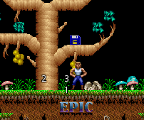
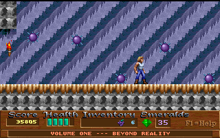
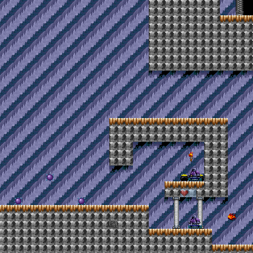

# Day 12 #

Good morning folks. When doing the switches and treasure boxes 
yesterday, I came to a realization. The column that I first attempted 
as the treasure box appearance actually seems to be the link between a 
switch and what it affects. Why don't we try drawing this identifier 
into the world to clearly indicate the effects of switches? If we don't 
like how it turns out, we can always disable it again.

To do this, I'm simply going to create a new method in the spritedb 
file to draw this onto the map. Since this is NOT debug text, we're 
going to want to draw this in a way that is more visible. I'm going to 
re-use the code from my Shadow Caster map to draw it first offset a 
couple times in black, then in white to get a bordered effect.

```py
def drawsprite(self, mappicture, objrec, mapdata):
    if objrec.sprtype not in self.sprites or \
            objrec.subtype not in self.sprites[objrec.sprtype]:
        self.addsprite(objrec.sprtype, objrec.subtype, sprite(
            self.graphics.debugimage(objrec.sprtype, objrec.subtype,
            objrec.width, objrec.height)))

    self.sprites[objrec.sprtype][objrec.subtype].draw(mappicture, objrec, mapdata)

    if objrec.info != 0:
        self.drawlabel(mappicture, (objrec.x -8, objrec.y -8), str(objrec.info))

def drawlabel(self, mappicture, coords, text):
    # Draw the text 5 times to create an outline
    # (4 x black then 1 x white)
    pen = ImageDraw.Draw(mappicture)
    for offset, colour in [( (-1,-1), (0,0,0) ),
            ( (-1,1), (0,0,0) ),
            ( (1,-1), (0,0,0) ),
            ( (1,1), (0,0,0) ),
            ( (0,0), (255,255,255) )]:
        pen.text((coords[0] + offset[0], coords[1] + offset[1]),
            text, font=self.markupfont, fill=colour)
```



Well, it seems to show up in too many places. I'm going to comment it 
out for now, but let's keep it in the back of our minds. We may still 
want something similar, but only for specific scenarios. This also 
appears to provide links for doorways, which is always handy.

In any case, I'm just going to go ahead and identify items in stage 4 
now. Though I'm getting really tired of going in and out of subfolders 
to try to find sprites. I'm going to flatten my export structure from 
the graphics file, and remove the record offset.

```py
    def save(self, outpath):
        createpath(outpath)
        for recnum, record in enumerate(self.records):
            record.save(outpath, recnum)
```

```py
def save(self, outpath, recnum):
    if self.numimages > 0:
        createpath(outpath)
        for tilenum, tile in enumerate(self.images):
            tile.save(os.path.join(outpath, '{:02}-{:04}.png'.format(recnum, tilenum)) )
```

The first few sprites weren't anything special, although I found the 
sprite number of an illusionary wall, which I made semi-transparent. 
However, I ran into the following location on the map:



Which doesn't contain any unknown sprites in my current map. This must 
be another object I'm not drawing. Let me comment out my hidden objects 
and find which one it is. But even turning off every identified sprite 
STILL doesn't draw anything in this location. It doesn't make any 
sense. I will finish mapping this stage, then double-check my map 
decoding to make sure I'm not missing any sprites somehow.

I also ran into ceiling spikes, which are apparently the same ID as 
floor spikes. Probably differentiated by the "colour" field. I'm going 
to go ahead and rename that field to appearance. Though looking at the 
objs file, it appears to be the next field one over. I'll tentatively 
call this one "direction" and update the variablesprite class to 
specify which field to look up. I'll have to use access the raw 
underlying python field dictionary to make it work, though.

```py
class variablesprite(sprite):
    def __init__(self, imagelookup, contents=None, field='apperance'):
        # Create a lookup of possible boxes
        self.types = imagelookup
        self.xoffs = 0
        self.yoffs = 0
        self.contents = contents
        self.field = field

    def draw(self, mappicture, objrec, mapdata):
        # Pick the correct image then use the parent routine to draw the box
        self.image = self.types[objrec.__dict__[self.field]]
        super(variablesprite, self).draw(mappicture, objrec, mapdata)

        # Place contents immediately above the current sprite
        if self.contents != None:
            mappicture.paste(self.contents, (objrec.x +self.xoffs,
                objrec.y +self.yoffs - self.contents.size[1]), self.contents)
```

```py
# Spikes:
self.addsprite(59, 0, variablesprite({
    0 : graphics.records[36].images[28],
    1 : graphics.records[36].images[32]},
    field='direction'))
```

Looking over the objects file, I figured out what was going on. Those 
bouncing ball traps reported themselves as having no size in the 
objects file! This malfunctioned by creating an invisible debug image. 
I'm going to go ahead and switch to always generate a debug image. For 
any sprites I did not want to draw, I'm going to redirect to record 36, 
image 28 instead (i.e. an empty sprite).

With that, stage 4 is complete.



[day12.zip][day12] is available. I've moved the CSVs and flat maps into 
a sub-folder in order to better organize things.

[day12]: http://www.zerker.ca/misc/xargon/day12.zip
