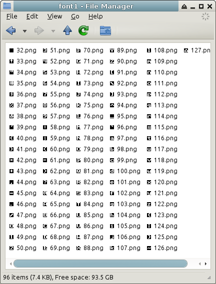
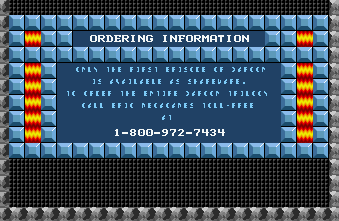
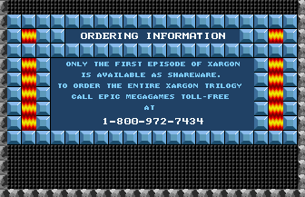
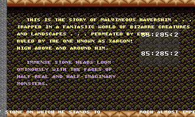

# Day 13 #

Now for something different. Today is font day!

For ROTT, I made my own font class, which contained an array of images 
that got pasted into the map. It worked, but this time I'd like to 
leverage the [PIL ImageFont][imagefont] capabilities (especially for the 
re-colouring). Problem is, I need to get the font data into a format 
that PIL can use. I see two options here:

1) Look up the format for BDF or PCF font files, and create one.
2) Figure out the underlying PIL font code and create a compatible 
   implementation based on the in-game font.

Looking at [the definition of BDF][bdf], that format doesn't look too 
bad, so I think that is the most likely avenue here. A side-effect of 
this is that we can actually use the Xargon font in BDF-supporting 
applications.

To get the font ready, I'm going to start a new file called 
xargonfontgen.py. This will create a BDF from both main fonts in the 
Xargon GRAPHICS file. To do this, we're going to need to convert the 
font images into 1-bit images. That said, we should get 256-colour 
exports of the font images to decide which "colours" are used. Let's 
update the xargongraphics save routines and main function:

```py
xargonimages.save('Images')
xargonimages.save('OriginalImages', masked=False)
```

```py
def save(self, outpath, masked=True):
    createpath(outpath)
    for recnum, record in enumerate(self.records):
        record.save(outpath, recnum, masked)
```

```py
def save(self, outpath, recnum, masked=True):
    if self.numimages > 0:
        createpath(outpath)
        if (masked):
            for tilenum, tile in enumerate(self.images):
                tile.save(os.path.join(outpath, '{:02}-{:04}.png'.format(recnum, tilenum)) )
        else:
            for tilenum, tile in enumerate(self.origimages):
                tile.save(os.path.join(outpath, '{:02}-{:04}.png'.format(recnum, tilenum)) )
```

I actually worked a bit ahead on this yesterday, but knew I wasn't 
going to finish in one day. Astute followers may have noticed the above 
updates already in yesterday's zip file.

Looking at one of the font images, they appear to be effectively 3-bit 
images, using values of 1, 2 and 3 (not 0). Value 3 is transparent. 
From my observations, the menu text appears to use the two different 
colours, but all the in-map text (i.e. what we care about) does not.

Next, let's compare the images to an ASCII table to make sure they're 
in the same order... and they are. Same indices too, although the 
non-printable characters appear to be re-used. So let's start with a 
basic class that can convert to 1-bit images, but instead of writing 
the font at first, let's write some debug images to make sure we're 
categorizing things correctly.

```py
from xargongraphics import createpath, imagefile
import sys, os
from PIL import Image

class xargonfont(object):
    @staticmethod
    def conv1bit(inimage):
        outimage = Image.new('1', inimage.size )
        imgdata = list(inimage.getdata())
        for index, pixel in enumerate(imgdata):
            imgdata[index] = 0 if pixel==3 else 1
        outimage.putdata(imgdata)
        return outimage

    def __init__(self, graphics, recnum):
        self.dimensions = graphics.records[recnum].images[0].size
        self.characters = [self.conv1bit(image) for image in graphics.records[recnum].origimages]

    def debugimages(self, outfolder):
        createpath(outfolder)
        for glyphnum, glyph in enumerate(self.characters):
            if glyphnum >= 32:
                glyph.save(os.path.join(outfolder, '{:02}.png'.format(glyphnum)) )


if __name__ == "__main__":
    if len(sys.argv) < 2:
        print """Usage: python xargongraphics.py [Graphics File]
TODO
"""
    else:
        for filename in sys.argv[1:]:
            graphics = imagefile(filename)
            font1 = xargonfont(graphics, 1)
            font2 = xargonfont(graphics, 2)
            font1.debugimages('font1')
            font2.debugimages('font2')
```



Looks about right. Note that the PIL 1-bit image has 1 = white, 0 = 
black. We can ignore this. The BDF format has the reverse definition, 
and that's what we really want to match.

So here's what I came up with to write out the BDF file:

```py
def createbdf(self, outname):
    with open(outname, 'w') as outfile:
        outfile.write("""STARTFONT 2.1
FONT {0}
SIZE {1[0]} 75 75
FONTBOUNDINGBOX {1[0]} {1[1]} 0 0
CHARS {2}\n""".format(self.name, self.size, 95))
        for charnum, char in enumerate(self.characters):
            if charnum >= 32 and charnum < 127:
                outfile.write("""STARTCHAR U+{0:04X}
ENCODING {0}
SWIDTH 0 0
DWIDTH {1[0]} 0
BBX {1[0]} {1[1]} 0 0
BITMAP\n""".format(charnum, self.size))
                for y in range(self.size[1]):
                    value = 0
                    for x in range(self.size[0]):
                        value = value + (char.getpixel((x,y)) << self.size[0]-x-1)
                    # Note: this will break if font width is > 8 bits!
                    outfile.write("{:02X}\n".format(value))
                outfile.write("ENDCHAR\n")
        outfile.write("ENDFONT\n")
```

Note that the alignment is a little bit funny because I'm using 
multi-line strings. Python's string format method really helps for 
filling in the data in the appropriate fields. For the meat of the 
function, I'm just combining each row of the image into a number by 
using add and bit shift. I'm sure there's a more efficient/pythonic way 
of doing it, but I only need this to work ONCE to get me a valid BDF 
file, then I can just keep using the output.

And here's what I get for the first two characters:
```bdf
STARTFONT 2.1
FONT xargon-font1
SIZE 8 75 75
FONTBOUNDINGBOX 8 8 0 0
CHARS 95
STARTCHAR U+0020
ENCODING 32
SWIDTH 0 0
DWIDTH 8 0
BBX 8 8 0 0
BITMAP
00
00
00
00
00
00
00
00
ENDCHAR
STARTCHAR U+0021
ENCODING 33
SWIDTH 0 0
DWIDTH 8 0
BBX 8 8 0 0
BITMAP
18
3C
3C
18
18
00
18
00
ENDCHAR
```

Seems promising. Let's try this font out.
```console
$ pilfont.py *.bdf
xargonfont1.bdf...
Traceback (most recent call last):
  File "/usr/bin/pilfont.py", line 48, in <module>
    p = BdfFontFile.BdfFontFile(fp)
  File "/usr/lib/python2.7/dist-packages/PIL/BdfFontFile.py", line 114, in __init__
    font[4] = bdf_slant[string.upper(font[4])]
IndexError: list index out of range
```

Uh oh. Now I need to debug someone ELSE's code. Well, more accurately, 
why my output is wrong and causing the code to crash. Anyhow, let's go 
open this up. The which command tells me pilfont.py is in 
``/usr/bin/pilfont.py``, so I'm going to open that up and find the line in 
question.

And that just points to the BdfFontFile class inside of PIL, so let's 
find that. Ah, it's processing the FONT line. I didn't think it would 
actually need any useful information from that. Let me try and update 
that to be more representative. It seems to me that it's just 
performing some adjustments to the name, so I should just need to make 
sure I have the right number of fields. I'll just grab the wikipedia 
example and code to match.

```py
outfile.write("""STARTFONT 2.1
FONT -{0}-medium-r-normal--{1[0]}-160-75-75-c-80-us-ascii
SIZE {1[0]} 75 75
FONTBOUNDINGBOX {1[0]} {1[1]} 0 0
CHARS {2}\n""".format(self.name, self.size, 95))
```

That gets us past that block, but now we get: ``KeyError: 'FONT_ASCENT'``. 
Well, we omitted FONT_ASCENT because the BDF spec says it's optional, 
and it doesn't really apply to us. Guess pilfont requires it. Let's 
just put it in and set it to the height with the DESCENT set to 0.

```py
outfile.write("""STARTFONT 2.1
FONT -{0}-medium-r-normal--{1[0]}-160-75-75-c-80-us-ascii
SIZE {1[0]} 75 75
FONTBOUNDINGBOX {1[0]} {1[1]} 0 0
STARTPROPERTIES 2
FONT_ASCENT {1[1]}
FONT_DESCENT 0
ENDPROPERTIES
CHARS {2}\n""".format(self.name, self.size, 95))
```

Now, pilfont runs with no errors. Let's try out the new .pil files.

```py
# Text sprites:
self.addsprite(6, 0, textsprite(ImageFont.load("font2.pil"), graphics))
self.addsprite(7, 0, textsprite(ImageFont.load("font1.pil"), graphics))
```

We can also take out the alignment corrections we added for the 
true-type font we picked inside the textsprite class.



Well, one font looks good, but the other is cut off. You know, I bet 
the BDF spec has left-aligned pixels instead of right-aligned pixels. 
This means I need to shift my 6-pixel font 2 images over 2 more pixels. 
For simplicity, I will simply update to align to an 8 bit number in my 
BDF export:

```py
for x in range(self.size[0]):
    value = value + (char.getpixel((x,y)) << 7-x)
```



There we go. Font victory!

Now, just for fun, I'm going to use the built-in Xargon font for all my 
debug images and stop including DroidSans.

Oh, BTW, I just noticed additional files that actually contain map data 
(DEMO*.XR1, INTRO.XR1, STORY.XR1), so I'll be sure to include those 
too. Unfortunately, my clever hackery for string processing has 
malfunctioned on the STORY scene:



I'll have to keep that in mind, but I probably won't be changing 
anything there for a while. Also, the map ID isn't a good way to 
recognize alternate palettes, as some of the auxiliary files have 
different palettes but the same map id of 0. I'm going to switch over 
to filenames.

```py
if self.name.upper() in ['BOARD_03', 'BOARD_05', 'BOARD_06',
        'BOARD_07', 'BOARD_09', 'BOARD_10', 'INTRO', 'DEMO1',
        'DEMO2', 'DEMO3']:
    graphics.changepalette(1)
else:
    graphics.changepalette(0)
```

FYI: [day13.zip][day13] is available.

[imagefont]: https://web.archive.org/web/20130213043629/http://www.pythonware.com/library/pil/handbook/imagefont.htm
[bdf]: https://en.wikipedia.org/wiki/Glyph_Bitmap_Distribution_Format
[day13]: http://www.zerker.ca/misc/xargon/day13.zip
