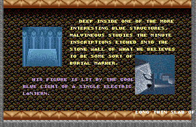
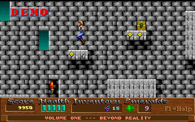
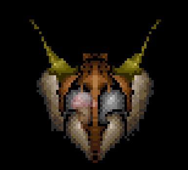

# Day 14 #

Good evening. The next couple days are likely going to be fairly 
boring. We have most of the functionality implemented, so I'm going to 
spend the time playing the game and identifying sprites. Yesterday we 
noticed a problem with the sprites in the Story map. I'll likely need 
to get some debug data output to look into that further, so I'm going 
to defer that to the weekend when I can look into it more.

The first thing I'm going to do is identify any sprite I can find in 
the menu maps and the demos. Following that, I'll continue where I left 
off in the game on stage 5.

The story scene sprites all appear continuous, so I can populate all of 
those with a simple loop:

```py
# Story Scenes:
for subtype in range(24):
    self.addsprite(85, subtype, sprite(graphics.records[56].images[subtype]))
    self.addsprite(86, subtype, sprite(graphics.records[57].images[subtype]))
```



Mapping for a bit, I found out that the Episode 3 demo has a slightly 
different colour palette, so I'll incorporate that.



```py
if self.name.upper() in ['BOARD_03', 'BOARD_05', 'BOARD_06',
        'BOARD_07', 'BOARD_09', 'BOARD_10', 'INTRO', 'DEMO1', 'DEMO2']:
    graphics.changepalette(1)
elif self.name.upper() == 'DEMO3':
    graphics.changepalette(2)
else:
    graphics.changepalette(0)
```

```py
palimage = Image.open('palimage3.png')
self.palette[2] = palimage.getpalette()
```

For Demo 1, I added an entry for floor/ceiling spears. However, I need 
to expand the variable sprite to allow offsets, because the floor image 
spear appears inside the floor. I also need to make the offets a list 
to match with the lookup.

```py
# Ceiling Spear
self.addsprite(43, 0, variablesprite({
    0 : graphics.records[36].images[9],
    1 : graphics.records[36].images[12]},
    offsets={0: (0, 0), 1:(0, -4) },
    field='direction'))
```

```py
class variablesprite(sprite):
    def __init__(self, imagelookup, contents=None, field='apperance', offsets=None):
        # Create a lookup of possible boxes
        self.types = imagelookup
        self.xoffs = 0
        self.yoffs = 0
        self.contents = contents
        self.offsets = offsets
        self.field = field

    def draw(self, mappicture, objrec, mapdata):
        # Pick the correct image then use the parent routine to draw the box
        self.image = self.types[objrec.__dict__[self.field]]
        if self.offsets != None:
            (self.xoffs, self.yoffs) = self.offsets[objrec.__dict__[self.field]]
        super(variablesprite, self).draw(mappicture, objrec, mapdata)

        # Place contents immediately above the current sprite
        if self.contents != None:
            mappicture.paste(self.contents, (objrec.x +self.xoffs,
                objrec.y +self.yoffs - self.contents.size[1]), self.contents)
```

I also notice that it looks like the flaming jet face has a hidden ice 
cream cone instead of the sprite that would say "this is a flaming jet 
face".



Since the face is in the background, I just need to recognize this case 
and simply not draw anything. Looking at the Object file, it appears 
that the flame jet instance has a 1 in what I called the "Direction" 
field, while the other two have 4. I'm going to rename that field to 
variant, and make a special variablesprite case for sprite 73, type 0 
in the spritedb:

```py
# Special case for 73, type 0. Variant 4 appears to be the pickup item.
# Other variants (all rendered invisible) appear to be:
# 1 : Flaming Face Jet (Down)
# 2 : Flaming Lava Jet (Up)
# 3 : TBC
self.addsprite(73, 0, variablesprite({
    1 : graphics.records[30].images[19],
    2 : graphics.records[30].images[19],
    3 : graphics.debugimage(73, 'T3', 16, 16),
    4 : sprite(graphics.semitransparent(
        graphics.records[37].images[0], 128))},
    field='variant'))
```

That works for most stages, but it looks like I somehow broke something 
in DEMO3:

```
Generating Map 'DEMO3'
Traceback (most recent call last):
  File "xargonmapper.py", line 68, in <module>
    mapper = xargonmapper(xargonimages, tiledata, themap)
  File "xargonmapper.py", line 49, in __init__
    sprites.drawsprite(self.mappicture, objrecord, mapdata)
  File "/data/Projects/Xargon/spritedb.py", line 196, in drawsprite
    self.sprites[objrec.sprtype][objrec.subtype].draw(mappicture, objrec, mapdata)
  File "/data/Projects/Xargon/spritedb.py", line 255, in draw
    super(variablesprite, self).draw(mappicture, objrec, mapdata)
  File "/data/Projects/Xargon/spritedb.py", line 226, in draw
    objrec.y +self.yoffs), self.image)
  File "/usr/lib/python2.7/dist-packages/PIL/Image.py", line 1079, in paste
    "cannot determine region size; use 4-item box"
ValueError: cannot determine region size; use 4-item box
```

That's a bit cryptic, so I think it's time to make my own exception handler to get more info.

```py
def drawsprite(self, mappicture, objrec, mapdata):
    try:
        if objrec.sprtype not in self.sprites or \
                objrec.subtype not in self.sprites[objrec.sprtype]:
            self.addsprite(objrec.sprtype, objrec.subtype, sprite(
                self.graphics.debugimage(objrec.sprtype, objrec.subtype,
                objrec.width, objrec.height)))

        self.sprites[objrec.sprtype][objrec.subtype].draw(mappicture, objrec, mapdata)

        #if objrec.info != 0:
        #    self.drawlabel(mappicture, (objrec.x -8, objrec.y -8), str(objrec.info))
    except:
        print "Problem with Sprite {}, Type {}, Appearance {}, Variant {} at ({}, {})".format(
            objrec.sprtype, objrec.subtype, objrec.apperance, objrec.variant,
            objrec.x, objrec.y)
        traceback.print_exc()
```

FYI: traceback.print_exc() will print the standard stack trace you get 
without any exception handler.

When I run it again, I get:

```
Problem with Sprite 73, Type 0, Appearance 0, Variant 4 at (848, 640)
Traceback (most recent call last):
< Snip >

Problem with Sprite 73, Type 0, Appearance 0, Variant 4 at (240, 592)
Traceback (most recent call last):
< Snip >
```

Okay, so it's something about the NORMAL semi-transparent ice cream 
cone. Let's look at that line.

```py
4 : sprite(graphics.semitransparent(
                graphics.records[37].images[0], 128))},
```

Gah, I'm declaring a sprite inside a variable sprite declaration! I 
should just be passing the semi-transparent image in directly. Fixing 
now.

And that's everything I can access from the main menu. I think I'll 
stop for today. [day14.zip][day14] is available.

[day14]: http://www.zerker.ca/misc/xargon/day14.zip
