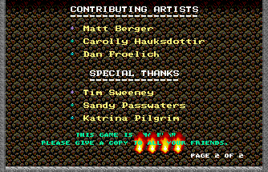
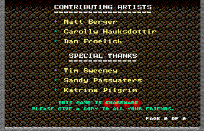
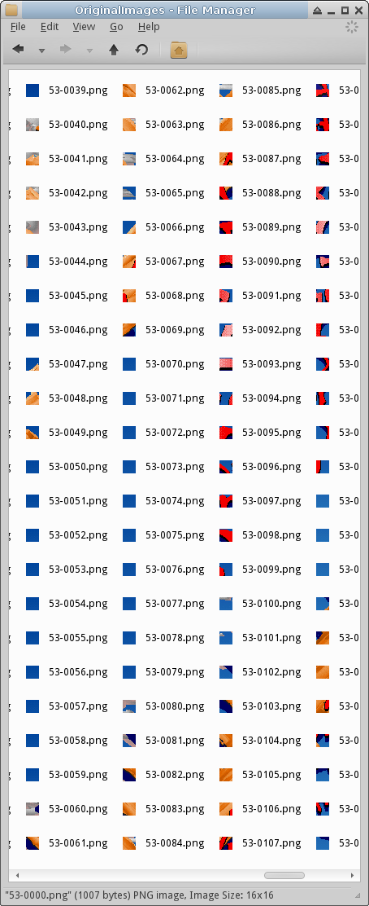
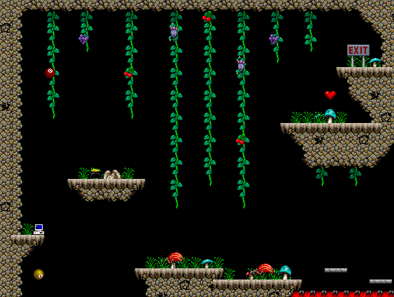
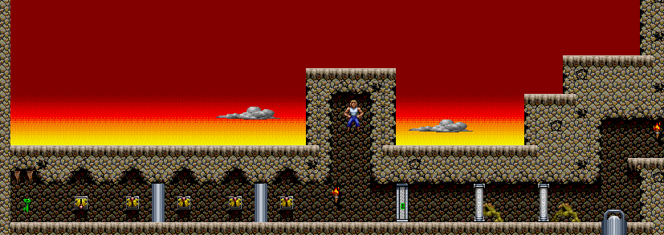
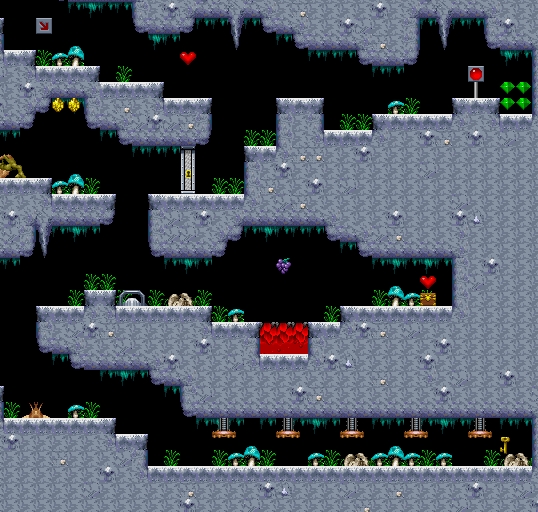

# Day 15 #

Hello again. Today will mostly just be me identifying some more 
sprites, but I thought I'd fix one general bug I noticed yesterday (and 
no, not the string order in the STORY stage). It's the problem where 
sprites are drawn over text, contrary to the in-game appearance.



So what I'm going to do is split the text sprites and non-text sprites 
into two separate lists, and always draw the text after everything 
else. The main change is in the map loading:

```py
self.objs = [objrecord(struct.unpack(objrecstruct,
    mapfile.read(struct.calcsize(objrecstruct)) ) )
    for i in range(numobjs)]

# Create separate sprite and text lists:
self.text = [obj for obj in self.objs if obj.sprtype in [6, 7] ]
self.sprites = [obj for obj in self.objs if obj.sprtype not in [6, 7] ]
```

And use these two lists for the map:

```py
for objrecord in mapdata.sprites:
    sprites.drawsprite(self.mappicture, objrecord, mapdata)
for objrecord in mapdata.text:
    sprites.drawsprite(self.mappicture, objrecord, mapdata)
```

Also, I'm going to make a really minor change and make the static flame 
sprites on the menus screens variable to take into account each 
version:

```py
# Menu Flame Jets:
self.addsprite(47, 0, variablesprite({
    6 : graphics.records[48].images[3],
    8 : graphics.records[48].images[4]},
    field='info'))
```

And here's the update:



And on a total whim, I decided to check the palette of the title screen 
and see if that's the correct palette for image record 53. Turns out it 
is!



Sorry folks, that's about all the excitement today. Now I just get to 
play the game some more and identify more sprites. Well, that's not 
true. I found out that invisible platforms can come in multiple 
variants. I just added one to support stage 6:

```py
# Variant of Compound and semi-transparent for hidden platform(s)
self.addsprite(11, 0, variablesprite({
    6: graphics.semitransparent(
       graphics.compositeimage((32, 16), [(0, 0, 25, 14),
       (16, 0, 25, 15)]), 128),
    7: graphics.semitransparent(
       graphics.compositeimage((32, 16), [(0, 0, 51, 10),
       (16, 0, 51, 11)]), 128) }
     ))
```

Stage 6 complete:



I did the stages out of order, so going back to stage 5 doesn't result 
in anything extraordinary. It has another palette, so I'll add that to 
the list. It also has switches and toggle-able walls. I will hide the 
wall sprites and draw the switches. I'll add the switches and walls to 
my "maybe label the link" list. A few more trap and item types round 
out the list.

Stage 5 complete:



Stage 7 complete too. Nothing major here. I'll pencil in the 
stalactites as another possible sprite to mark with trigger 
identifiers, so we can tell when they would drop (and what causes 
them).



[day15.zip][day15] is available.

[day15]: http://www.zerker.ca/misc/xargon/day15.zip
