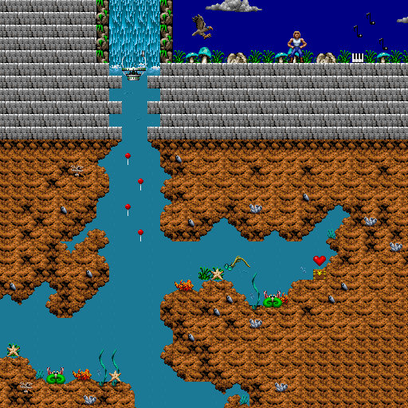
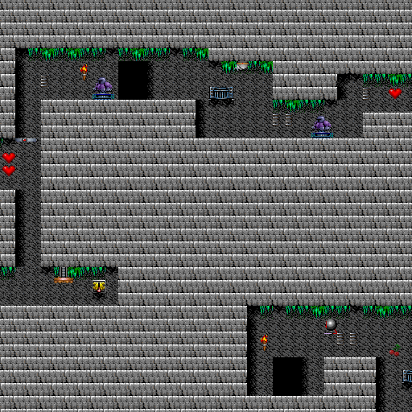

# Day 16 #

Another day, more maps. Today I will be filling in the gaps for the 
next couple levels in the game. The further we get, the fewer sprites 
need identification. We'll see when we identify them all 🙂️.

Another map, another palette. I'm going to rename the palette images to 
start at 0 and generalize this a bit:

```py
self.palette = {}
for i in range(6):
    palimage = Image.open('palimage{}.png'.format(i) )
    self.palette[i] = palimage.getpalette()
```

Stage 8 is done:



And Stage 9:



Not a big day today. I'll map the final stage of Episode 1 tomorrow, 
then get to some of the other tasks I've been putting off before 
submitting them for the site. Episode 2 will follow that. [day16.zip][day16] is 
available.

[day16]: http://www.zerker.ca/misc/xargon/day16.zip
