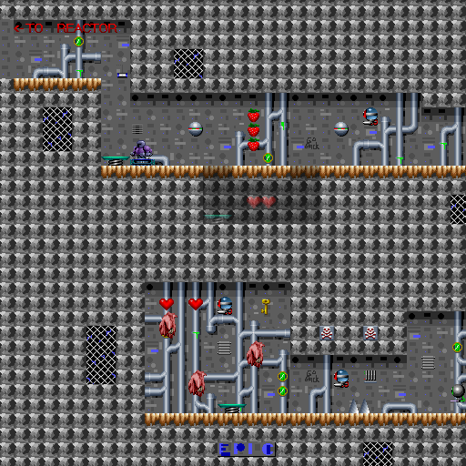
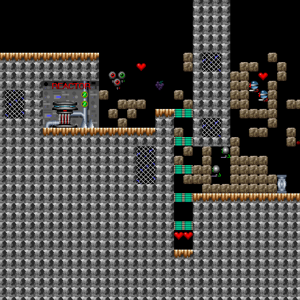
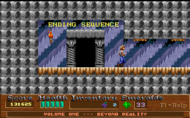
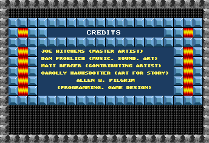

# Day 17 #

Time for the final level(s) and ending! Stage 10 isn't too complicated. 
There's just another illusionary wall, and the "To Reactor" Sign. 
There's also some sort of unidentified pickup hidden behind an 
illusionary wall with the ID of *42:0*. Since the yellow gem was *42:3*,
I'm going to take the educated guess that this is the green gem. I'll 
comment it as "TBC" in case I actually see one in Episodes 2 or 3.

Stage 10 done:



Now, the Reactor stage. First, it appears to have the wrong palette, so 
I'll fix that immediately. Second, it has these infinite floating robot 
spawners. I'm going to create a "composite" sprite containing a couple 
robots clustered together and see how that looks.

```py
# Special case for 73, type 0. Variant 4 appears to be the pickup item.
# Other variants (all rendered invisible) appear to be:
# 1 : Flaming Face Jet (Down)
# 2 : Flaming Lava Jet (Up)
# 3 : Robot Spawner
self.addsprite(73, 0, variablesprite({
    1 : graphics.records[30].images[19],
    2 : graphics.records[30].images[19],
    3 : graphics.compositeimage((32, 32), [(0, 0, 59, 1),
       (16, 0, 59, 4), (8, 12, 59, 1)]),
    4 : graphics.semitransparent(
        graphics.records[37].images[0], 128)},
    field='variant'))
```

Reactor Stage (32) Done:



Ending sequence time. It looks like the ending has a special font-mode 
which actually uses the two colours for the fonts. Since my setup 
doesn't let me do that, I'm going to work-around this by drawing the 
text twice, once for each colour, to get a somewhat similar effect.  
Right now it shows up as dark gray, which is wrong.



```py
def draw(self, mappicture, objrec, mapdata):
    pen = ImageDraw.Draw(mappicture)

    if objrec.appearance == 8:
        # Simulate multi-colour appearance by creating a fake shadow effect
        pen.text((objrec.x, objrec.y), mapdata.getstring(objrec.stringref),
                font=self.font, fill=self.graphics.getcolour(14))
        pen.text((objrec.x-1, objrec.y), mapdata.getstring(objrec.stringref),
                font=self.font, fill=self.graphics.getcolour(6))
    else:
        pen.text((objrec.x, objrec.y), mapdata.getstring(objrec.stringref),
                font=self.font, fill=self.graphics.getcolour(objrec.appearance))
```



Not perfect, but a reasonable facsimile. It will do. With that, the 
shareware game is fully mapped. It just needs a few tweaks before it's 
ready for the site.

Oh, but there are a few sprites in the "demo" stages that we haven't 
identified. And, unfortunately, we CAN'T identify without playing the 
original versions of those stages. Since the demo stages are 
essentially identical to their original versions, there's no real 
reason to submit these.

[day17.zip][day17] is available.

[day17]: http://www.zerker.ca/misc/xargon/day17.zip
