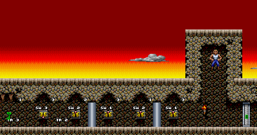
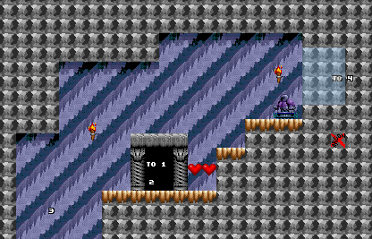
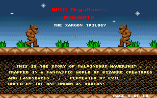
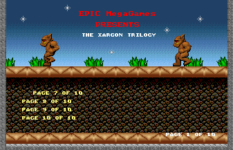

# Day 18 (Episode 1 complete) #

Hello folks. It's cleanup day. Here are the outstanding tasks I have 
written down, in the order I'm going to tackle them:

 * The player start and one mountain look misaligned on the map and 
   should be adjusted.
 * Re-add switch indicators, with filtering to remove other uses of 
   this field.
 * Add correct monster facing.
 * Fix the string ordering on the STORY scene.

We'll see if we can get these all done today, or if it will spill over 
into tomorrow.

Task 1 is easy, we just add an offset of 4 to each sprite:
```py
# Map Images that need alignment:
for (sprtype, subtype, recnum, imagenum) in [
        (5, 0, 47, 8), # Map Player
        (88, 4, 47, 22), (88, 5, 47, 23)]:
    self.addsprite(sprtype, subtype, sprite(
        graphics.records[recnum].images[imagenum], xoffs=4))
```

For task 2, I'm going to start by enabling the existing code, and 
adding the sprite ID to each string for easy debugging (and filter list 
population). I'm also going to use the smaller font for this.

```py
if objrec.info != 0:
    self.drawlabel(mappicture, (objrec.x -8, objrec.y -8),
        "{} ({}:{})".format(objrec.info, objrec.sprtype, objrec.subtype))
```

With that done, I need a mechanism for filtering our numbers on some 
sprites. I'm going to add some optional parameters to the sprite 
``__init__`` methods. Then, I move the label code into the sprite code, and 
adjust accordingly. It also looks like some of the high numbers (>=90) 
are used for form changes, so I will hide those automatically. I'll 
also add the ability to specify the label offset, for entries (like the 
trigger pickups) where the switch is the primary purpose.

```py
class sprite(object):
    def __init__(self, image, xoffs=0, yoffs=0, hidelabel=False,
            labelpref='', labeloffs=(-8, -8)):
        self.image = image
        self.xoffs = xoffs
        self.yoffs = yoffs
        self.hidelabel = hidelabel
        self.labelpref = labelpref
        self.labeloffs = labeloffs

    def draw(self, mappicture, objrec, mapdata):
        # When pasting masked images, need to specify the mask for the paste.
        # RGBA images can be used as their own masks.
        mappicture.paste(self.image, (objrec.x +self.xoffs,
            objrec.y +self.yoffs), self.image)

        if objrec.info != 0 and objrec.info < 90 and not self.hidelabel:
            text = "{}{} ({}:{})".format(self.labelpref, objrec.info,
                objrec.sprtype, objrec.subtype)

            # Draw the text 5 times to create an outline
            # (4 x black then 1 x white)
            pen = ImageDraw.Draw(mappicture)
            for offset, colour in [( (-1,-1), (0,0,0) ),
                    ( (-1,1), (0,0,0) ),
                    ( (1,-1), (0,0,0) ),
                    ( (1,1), (0,0,0) ),
                    ( (0,0), (255,255,255) )]:
                pen.text( (objrec.x +self.xoffs +offset[0] +self.labeloffs[0],
                    objrec.y +self.yoffs +offset[1] +self.labeloffs[0]),
                    text, font=markupfont, fill=colour)
```

Then I just need to actually use hidelabel and labelpref members for 
some good. Hidelabel is just to remove the clutter of useless 
information, but labelpref is to ADD info. Specifically, to give the 
label numbers more context. I'm going to use this for the doorways 
first:

```py
self.addsprite(61, 0, sprite(graphics.records[30].images[19])) # Out Door
self.addsprite(62, 0, sprite(graphics.records[30].images[19], labelpref='To ')) # In Door
```

And the main ones to hide:

```py
for sprtype in [17, 63]:
    for subtype in range(-1, 11):
        self.addsprite(sprtype, subtype, sprite(graphics.records[30].images[19],
            hidelabel=True))
```

Now I'll just go ahead and hide anything else that looks like it needs 
it.

And done. However, there are two cases that need to be fixed, and I 
think they will both require pre-processing. Case 1 is that all locked 
doors appear to have switch triggers. We don't want to display these, 
because the use of locked doors is fairly obvious. In order to remove 
this ONE use of triggers, we will need to first find all locked doors, 
then erase the info value for any triggers that match.

The second update is very minor, but on stage 5, it appears that two 
triggers are on the same tile. The pre-processing will simply need to 
move one down (or up) about 8 pixels.

```py
def preprocessmap(self, mapdata):
    switchlocations = []
    doorinfos = []

    # First loop: find all door info values and move doubled up sprites.
    for objrec in mapdata.sprites:
        if objrec.sprtype == 12:
            while (objrec.x + objrec.y*128*16) in switchlocations:
                objrec.y += 8
            switchlocations.append(objrec.x + objrec.y*128*16)

        if objrec.sprtype == 9:
            doorinfos.append(objrec.info)

    # Second loop: Erase switches that align with doors
    for objrec in mapdata.sprites:
        if objrec.sprtype == 12 and objrec.info in doorinfos:
            objrec.info = 0
```

Not too hard. Now I just take out the debug sprite ID, and the labels 
are good to go.

 

My convention is to add "To" for a Doorway transition, "TR" for a 
pickup trigger, and "SW" for a toggle switch. Let me know if anything 
is unclear or you have any suggestions. I thought of adding "W" for the 
toggle walls, but I think they should be okay as-is.

Monster facing is next. Let's start with Stage 3, which obviously has 
monsters facing both directions. If we filter by monster 55, we get:

```
55  880     400 2   0   32  48  0   0   0   0   0   0   0   0   0
55  560     304 2   0   32  48  0   0   0   0   0   0   0   0   0
55  1440    336 2   0   32  48  0   0   0   0   0   0   0   0   0
55  400     944 -2  0   32  48  0   0   0   0   0   0   0   0   0
55  1904    960 3   0   32  48  0   0   0   0   0   0   0   0   0
55  160     864 3   0   32  48  0   0   0   0   0   0   0   0   0
55  560     864 -1  0   32  48  0   0   0   0   0   0   0   0   0
55  1232    400 -4  0   32  48  0   0   0   0   0   0   0   0   0
55  1712    928 -1  0   32  48  0   0   0   0   0   0   0   0   0
55  304     336 1   0   32  48  0   0   0   0   0   0   0   0   0
```

So, I don't see a left-right, but I do see a positive-negative 
correlation. The actual number probably specifies the exact initial 
sprite, which we will likely have a very hard time guessing. I'm going 
to assume positive is left, and negative is right. I'm also going to 
use a different frame of animation for each ID just for the hell of it.

```py
# Monsters:
# Brute
self.addsprite(55, 0, variablesprite({
    -4 : graphics.records[61].images[4],
    -3 : graphics.records[61].images[5],
    -2 : graphics.records[61].images[6],
    -1 : graphics.records[61].images[7],
    0 : graphics.records[61].images[8],
    1 : graphics.records[61].images[9],
    2 : graphics.records[61].images[10],
    3 : graphics.records[61].images[11],
    4 : graphics.records[61].images[12],
    } ))
```

But it's not correct. Compare the below screenshot to the STORY screen:

 

Well, STORY is easy, because the sprites don't move, so I'll pick exact 
matches for them. Then I'll go play through Stage 3 again and see if I 
can figure out the initial facing of each monster.

Unfortunately, that's rather difficult to do. Here's the best I was able to come up with:
```py
self.addsprite(55, 0, variablesprite({
    -4 : graphics.records[61].images[12],
    -3 : graphics.records[61].images[11],
    -2 : graphics.records[61].images[10],
    -1 : graphics.records[61].images[9],
    0 : graphics.records[61].images[8],
    1 : graphics.records[61].images[0],
    2 : graphics.records[61].images[1],
    3 : graphics.records[61].images[2],
    4 : graphics.records[61].images[3]
    } ))
```

Let's go ahead and do some other monsters. I'll leave the centipede 
as-is, because the only known instances all face in the same direction. 
Most other monsters appear to just use 0 and 2.

That's done. Still not 100% convinced, but it adds variety, and it's 
better than we had before.

Now strings. We're going to need more information for this, so let's 
add another output to the debug mode for xargonmap.py.

```py
# Standalone debug string list:
with open(self.name + '_strings.csv', 'wb') as csvfile:
    writer = csv.writer(csvfile)
    for stringnum, lookupval in enumerate(self.stringlookup):
        writer.writerow([stringnum, lookupval, self.strings[stringnum]])
```

With that listing in place, I will try to identify all the 
discrepancies by comparing screenshots against my map output. For each 
discrepancy, to the right of the string that "actually appears", I will 
put the string that "should be there", as well as the index in the 
string array for that string. Without a better idea, I think I'm just 
going to have to correct the alignment discrepancy in the lookup array.

With that in place, I can put together a simple set of corrections to 
fix the alignment. Most of them are shifted by 4, so we only need to 
take into account the entries OTHER than the ones that shift by 4. 
Generally, this just means moving a few of the page number entries to 
different places in the list.

```py
# String adjust for STORY map:
if mapdata.name.upper() == 'STORY':
    page3to5 = mapdata.stringlookup[117:120]
    page6 = mapdata.stringlookup[82]
    page7 = mapdata.stringlookup[81]
    page8 = mapdata.stringlookup[84]
    page9 = mapdata.stringlookup[83]
    page10 = mapdata.stringlookup[116]

    del mapdata.stringlookup[116:120]
    del mapdata.stringlookup[81:85]

    mapdata.stringlookup[81:81] = page3to5 + [page6, page7, page8, page9, page10]
```

I confused myself a little bit figuring out exactly which value I was 
moving (original string ID vs string position in array). All is good 
now, however. This means that Episode 1 maps are complete!

[day18.zip][day18] is available. Episode 1 maps are also on [my website][ep1], 
and submitted to VGMaps. Tomorrow I will start Episode 2.

[day18]: http://www.zerker.ca/misc/xargon/day18.zip
[ep1]: https://zerker.ca/home/xargon-episode-1-maps.html
