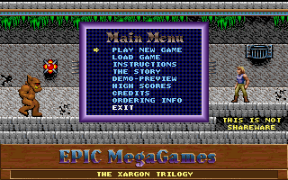
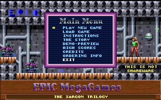
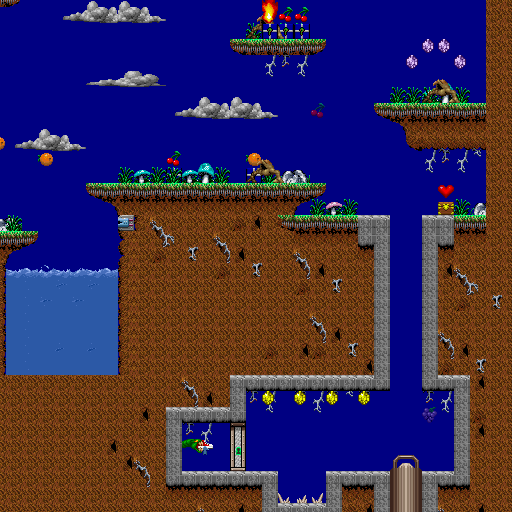
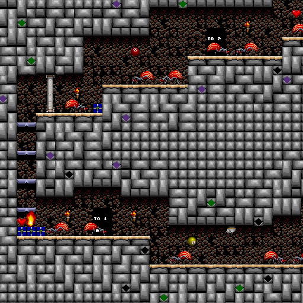
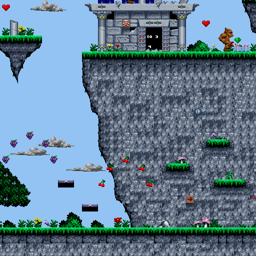
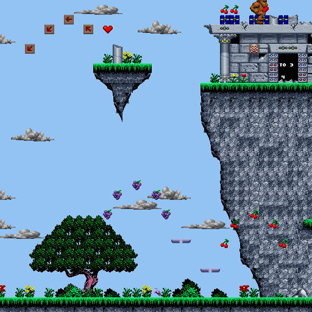

# Day 19 #

Hello again. Today is the day we make the mapper script work with 
Episodes 2 and 3. The first thing I noticed when firing up the other 
two episodes is that each one has a different colour palette:

 

And I suspect the Graphics file will have slightly different contents. 
Before doing anything else, I'm going to run my Graphics script on the 
other GRAPHICS files with the episode 1 palette. I should be able to 
compare the results to see what's different.

And Beyond Compare tells me there's very little that's actually 
different. A few missing sprites (notably the story scenes) and a few 
extra. Nothing that should totally break things, but the spritedb will 
need to be populated based on the episode number. We can't have it 
populating sprites that don't exist.

Also, there's the nature of the alternate palettes per episode. So 
let's get the files upgraded to detect episode number from the file 
extension. To do this, we add this line to xargonmap.py:

```py
self.epnum = int(tempext[-1])
```

and to xargongraphics.py:

```py
self.epnum = int(filename[-1])
...
if self.epnum == 2:
    self.activepal = 6
elif self.epnum == 3:
    self.activepal = 7
else:
    self.activepal = 0
```

And for debug:

```py
xargonimages.save('Episode{}Images'.format(xargonimages.epnum))
xargonimages.save('Episode{}OriginalImages'.format(xargonimages.epnum), masked=False)
```

Let's update xargonmapper.py to tie this together. I'll also clean up 
the Episode 1 palette choice, since more stages use the "DARK" palette 
than otherwise:

```py
if self.epnum == 2:
    # Episode 2
    graphics.changepalette(6)
elif self.epnum == 3:
    # Episode 3
    graphics.changepalette(7)
else:
    # Episode 1
    if self.name.upper() in ['BOARD_01', 'BOARD_02', 'BOARD_04']:
        graphics.changepalette(0)
    elif self.name.upper() == 'DEMO3':
        graphics.changepalette(2)
    elif self.name.upper() == 'BOARD_05':
        graphics.changepalette(4)
    elif self.name.upper() in ['BOARD_08', 'BOARD_33']:
        graphics.changepalette(5)
    else:
        graphics.changepalette(1)

sprites = spritedb(graphics, mapdata.epnum)
```

And save to a subfolder:

```py
def save(self):
    epfolder = 'Episode{}'.format(self.epnum)
    createpath(epfolder)
    self.mappicture.save(os.path.join(epfolder, self.name + '.png'))
```

And go by my sprite comparison to see which sprites are not in Episode 
2, which looks like 56, 57 and 62. 62 I expect is in Episode 3, though.

```py
# Skull Slug!
if epnum != 2:
    self.addsprite(75, 0, variablesprite({
        -1 : graphics.records[62].images[2],
        0 : graphics.records[62].images[0],
        1 : graphics.records[62].images[5],
        2 : graphics.records[62].images[3]
        }, hidelabel=True ))

...

# Story Scenes:
if epnum == 1:
    for subtype in range(24):
        self.addsprite(85, subtype, sprite(graphics.records[56].images[subtype]))
        self.addsprite(86, subtype, sprite(graphics.records[57].images[subtype]))
```

Then we run it and find out what breaks...

On the whole, it works. There are a few monster sprites with unmatched 
direction indices. Let me just fill those in now, run it again to 
confirm, then run it on Episode 3. Episode 3 has a couple more indices 
to fill in, including new hidden platform types. I will add those as 
debug images until I can see them in-game.

```py
# Variant of Compound and semi-transparent for hidden platform(s)
self.addsprite(11, 0, variablesprite({
    2: graphics.debugimage(11, 'T2', 32, 16),
    4: graphics.debugimage(11, 'T4', 32, 16),
    6: graphics.semitransparent(
       graphics.compositeimage((32, 16), [(0, 0, 25, 14),
       (16, 0, 25, 15)]), 128),
    7: graphics.semitransparent(
       graphics.compositeimage((32, 16), [(0, 0, 51, 10),
       (16, 0, 51, 11)]), 128) }
     ))
```

Same goes for the new spawner varient (sprite 73).

Well, that's all done. Now we just need to identify new sprites to get 
the Episode 2 maps up to code. But first, I'm going to make one fix to 
the Episode 1 maps based on what I've seen of Episodes 2 and 3: Trigger 
Number of -1. This doesn't ever appear to be linked to anything and 
doesn't have any specific use for a map. So I will exclude it and only 
draw positive numbers:

```py
if objrec.info > 0 and objrec.info < 90 and not self.hidelabel:
```

With that, a new palette, and a couple new sprites, Episode 2, Stage 1 
is complete:



Oh, btw, the world map was complete before we even started (yay for 
reuse), but DarkWolf has already submitted the map to the site.

Stage 2 was almost done for me, and only needed a single new treasure 
box type. That said, one of the doorway labels is obscured by a spider, 
so I'm going to add doorways and triggers to the "text" list so they 
are drawn on top.

```py
self.text = [obj for obj in self.objs if obj.sprtype in [6, 7, 12, 61, 62] ]
self.sprites = [obj for obj in self.objs if obj.sprtype not in [6, 7, 12, 61, 62] ]
```

Since switches moved to the "text" list, we also need to adjust our 
post-processing routines:

```py
# First loop: find all door info values
for objrec in mapdata.sprites:
    if objrec.sprtype == 9:
        doorinfos.append(objrec.info)

# Second loop: Erase switches that align with doors and move doubled up sprites.
for objrec in mapdata.text:
    if objrec.sprtype == 12:
        while (objrec.x + objrec.y*128*16) in switchlocations:
            objrec.y += 8
        switchlocations.append(objrec.x + objrec.y*128*16)
        if objrec.info in doorinfos:
            objrec.info = 0
```

And here's stage 2, illustrating the tricky asymmetric doorways 🙂️.



Stage 3 introduces two new enemies: evil purple bunnies and mini 
dinosaur things. Let's add them both to the sprite DB and continue. I'm 
also going to pick the jumping animation for the bunny because they are 
SMALL otherwise.

```py
# Mini Dino
if epnum != 1:
    self.addsprite(58, 0, variablesprite({
        -1 : graphics.records[56].images[5],
        0 : graphics.records[56].images[4],
        1 : graphics.records[56].images[1],
        2 : graphics.records[56].images[0],
        } ))
...
# Evil Bunny
if epnum != 1:
    self.addsprite(70, 0, variablesprite({
        0 : graphics.records[63].images[4],
        2 : graphics.records[63].images[1],
        } ))
```

Stage 3 is ALMOST done now. I realize there's a minor glitch, that 
didn't manifest in Episode 1:



We need to make sure to use the tile mask data, and draw the map with 
the proper background colour (index 250 in the palette). This should be 
fairly simple. First, the initial map image should start from this 
colour, then we need to paste in tiles using their mask.

```py
self.mappicture = Image.new("RGB", (128*16, 64*16), graphics.getcolour(250) )

...

tileimg = tiledata.gettile(graphics, tileval)
self.mappicture.paste(tileimg, (x*16, y*16), tileimg )
```

Better now:



I could keep going, but I think that's enough for today.

[day19.zip][day19] is available.

[day19]: http://www.zerker.ca/misc/xargon/day19.zip
