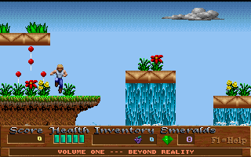
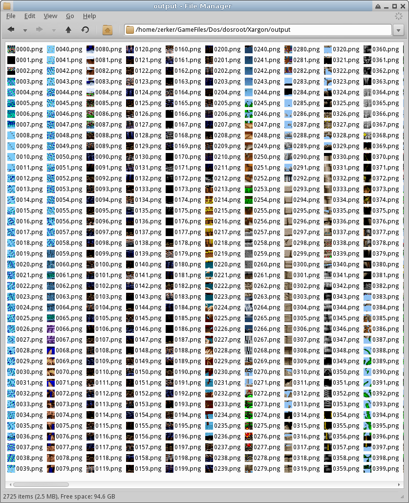
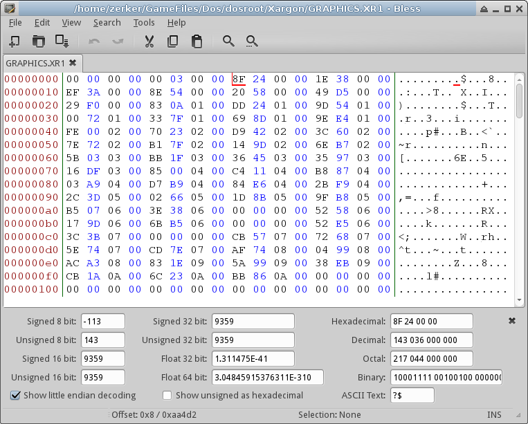
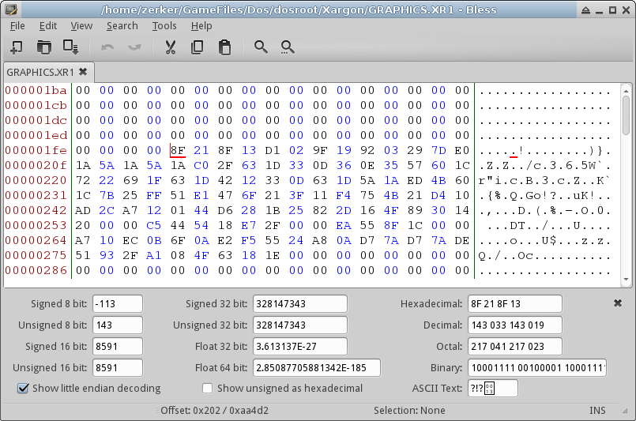

# Day 2 #

Yesterday we got the map format decoded. While I can visualize more of
the maps the same way, let's go ahead and try to figure out the tile
format. Now, Xargon is a 256 colour VGA game, so we're going to need a
colour palette. We also need to know what dimension of tile we are
looking for. Both of these goals can be accompished by taking a simple
screenshot (via Dosbox for me):



Looks like 16 x 16 tiles to me. Looking through the Xargon directory,
GRAPHICS.XR1 is the most likely candidate for containing tile
information. With the lack of a better idea, I'm going to just assume
it contains a whole bunch of RAW 16 x 16 images in order. With a
filesize of 697555, and each tile taking up 16*16 = 256 bytes, that is
about 2724.8 tiles. Let's cook up a quick looping RAW image importer
with PIL and see what we get:

```py
import struct, sys, os
from PIL import Image

if __name__ == "__main__":
    if len(sys.argv) < 2:
        print """Usage: python xargongraphics.py [Graphics File]
TODO
"""
    else:
        for filename in sys.argv[1:]:
            filesize = os.path.getsize(filename)
            graphicsfile = open(filename, 'rb')

            # Use the screenshot to grab the proper colour palette:
            palimage = Image.open('screeny.png')
            palette = palimage.getpalette()

            for tilenum in range(filesize/(16*16)):
                tile = Image.fromstring("P", (16, 16),
                    graphicsfile.read(16*16))
                tile.putpalette(palette)
                tile.save(os.path.join('output', '{:04}.png'.format(tilenum)) )

            # Since the file does not evenly align with the tiles we are
            # attempting to read, explicitly re-read the very end of the
            # file as a tile.

            graphicsfile.seek(filesize - (16*16) )
            tile = Image.fromstring("P", (16, 16),
                graphicsfile.read(16*16))
            tile.putpalette(palette)
            tile.save(os.path.join('output', 'last.png') )
```

And the results are:



Not a horrible assumption. There are some properly decoded (be it
shifted) tiles among there. But there are also some images that look
misaligned (i.e. not 16 x 16), and some random pixels (which imply
headers). There's also a repeating pattern at the top of the file with
random pixels that may be an overall file header (i.e. Images 0000 and
0002). Zooming the image shows that each record appears to be 4 bytes in
length.

Scrolling through each of these 4-byte regions and looking at the
decoding panel in my hex editor, each region appears to be a simple
32-bit integer, and each number is larger than the previous. (example
below)



Let's decode those numbers. I locally commented out the image code and
am excluding it from below for brevity. Counting the bytes in the Hex
editor, it appears to end at offset 0xF8 for a total of 62 records. Also
note that pdb.set_trace() in the below example invokes the python
debugger where we can inspect data interactively. This also saves me the
trouble writing a print statement for debug data.

```py
import struct, sys, os, pdb
from PIL import Image

if __name__ == "__main__":
    if len(sys.argv) < 2:
        print """Usage: python xargongraphics.py [Graphics File]
TODO
"""
    else:
        for filename in sys.argv[1:]:
            filesize = os.path.getsize(filename)
            graphicsfile = open(filename, 'rb')

            header = '<62L'

            headerdata = struct.unpack(header,
                graphicsfile.read(struct.calcsize(header)) )

            pdb.set_trace()
```

Running that gives us the the python debugger prompt:

```
zerker@Iota:/data/GameFiles/Dos/dosroot/Xargon$ python xargongraphics.py GRAPHICS.XR1
> /data/GameFiles/Dos/dosroot/Xargon/xargongraphics.py(28)<module>()
-> for filename in sys.argv[1:]:
(Pdb) headerdata
```

At which we can simply type the name of the variable we want to inspect
to see its content:

```
(Pdb) headerdata
(0, 768, 9359, 14366, 15087, 21646, 22560, 54601, 61481, 68227, 74973, 87197, 94720, 98099, 101737, 124062, 131326, 140144, 148185, 155708, 160382, 163761, 171284, 178030, 197467, 204731, 214326, 235317, 253718, 262277, 266692, 296888, 305411, 309719, 321156, 325931, 343340, 353794, 363293, 374943, 395189, 407614, 0, 415826, 433431, 439659, 0, 451922, 473916, 0, 481227, 485490, 488542, 491213, 554159, 563460, 566188, 597635, 629082, 650040, 662219, 664428)
```

Keep in mind the file size of this graphics file is 697555. The last
number is close, but does not exceed this number. This implies to me
that these are all file offsets, probably delimiting the start of a
region of data in the file. Since image 0002 also looks like header
data, let's look at that too:



Well, it's smaller. Suspiciously looks like half as small, in fact.
Let's grab that too and decode it as a series of 16 bit integers.

```py
import struct, sys, os, pdb
from PIL import Image

if __name__ == "__main__":
    if len(sys.argv) < 2:
        print """Usage: python xargongraphics.py [Graphics File]
TODO
"""
    else:
        for filename in sys.argv[1:]:
            filesize = os.path.getsize(filename)
            graphicsfile = open(filename, 'rb')

            header = '<62L'

            headerdata = struct.unpack(header,
                graphicsfile.read(struct.calcsize(header)) )

            graphicsfile.seek(0x200)

            header2 = '<62H'

            headerdata2 = struct.unpack(header2,
                graphicsfile.read(struct.calcsize(header2)) )

            pdb.set_trace()
```

And compare the two headers:

```
(Pdb) headerdata
(0, 768, 9359, 14366, 15087, 21646, 22560, 54601, 61481, 68227, 74973, 87197, 94720, 98099, 101737, 124062, 131326, 140144, 148185, 155708, 160382, 163761, 171284, 178030, 197467, 204731, 214326, 235317, 253718, 262277, 266692, 296888, 305411, 309719, 321156, 325931, 343340, 353794, 363293, 374943, 395189, 407614, 0, 415826, 433431, 439659, 0, 451922, 473916, 0, 481227, 485490, 488542, 491213, 554159, 563460, 566188, 597635, 629082, 650040, 662219, 664428)
(Pdb) headerdata2
(0, 8591, 5007, 721, 6559, 914, 32041, 6880, 6746, 6746, 12224, 7523, 3379, 3638, 22325, 7264, 8818, 8041, 7523, 4674, 3379, 7523, 6746, 19437, 7264, 9595, 20991, 18401, 8559, 4415, 30196, 8523, 4308, 11437, 4775, 17409, 10454, 9499, 11650, 20246, 12425, 8212, 0, 17605, 6228, 12263, 0, 21994, 7311, 0, 4263, 3052, 2671, 62946, 9301, 2728, 31447, 31447, 20958, 12179, 2209, 25423)
```

Interesting. Record sizes maybe? Let's compare differences between
offsets for a few adjacent regions to the second set of data to test
this theory:

```
(Pdb) headerdata[2]-headerdata[1]
8591
(Pdb) headerdata[3]-headerdata[2]
5007
(Pdb) headerdata[4]-headerdata[3]
721
```

Perfect match. I'm convinced. Now, going by the debug images I already
generated, the first region appears to be a whole lot of blue and will
be difficult to determine on its own. Let's start with the second
region, at offset 9359 (0x248F hex). Since each picture is 256 bytes
(0x100 hex), that puts towards the end of picture 0x24 (36 decimal).
Hrm, still too much blue. Let's jump ahead until we get to the images.
The next is 14366 -> image 56, which is still blue, but the following
is 15087 -> 58 which starts to look like something. It also puts is one
pixel before the last row of the image, which looks like another header.
Since we're offset by 1, and the next image matches the last pixel in
this image, I suspect the header is 16 bytes. I'll just copy the bytes
from the hex editor:

``24 01 00 D0 06 10 0D 90 19 08 04 00 08 10 00 10``

Now we need to guess the bit size of each field in this header. Remember
that we are little endian. The first four bytes are:

``24 01 00 D0``

If we think this is 32 bits, that's either -805306076 (signed) or
3489661220 (unsigned), or -8.590234E+09 (floating). None of those are
particularly likely (and floats aren't very common for old DOS games in
general).

16 bits yields 292, while 8 bits yield 36. Both are possible.

If we go with 36, 01 is unused, and is obviously just a simple 1. Let's
convert the whole sequence to simple 8 bit decimal numbers and see if it
makes sense:

``36 1 0 208 6 16 13 144 25 8 4 0 8 16 0 16``

And as 16 bits (unsigned):

``292 53248 4102 36877 2073 4 4104 4096``

I think it's likely we have either an 8 bit sequence or some sort of
hybrid.

I'm scratching my head, so let's get another sample. The next few
sample images look like noise, so they may be some other form of data,
or just unrecognizably misaligned. Let's jump ahead to the really
recognizable tiles around image 293. 293 is offset 75008, and from
above, the closest record starts at 74973 (image 292, pixel 221). Looks
like another 16 byte header to me. Hex values are:

``2F 01 00 7C 0C 3C 18 BC 2F 08 04 00 10 10 00 0F``

Decimal:

``47 1 0 124 12 60 24 188 47 8 4 0 16 16 0 15``

Gah, let's just grab them all and decode this way, then turn it into a
CSV.

```py
import struct, sys, os, pdb, csv
from PIL import Image

def imageheader(fileref, offset):
    fileref.seek(offset)
    headerstruct = '<16B'
    return struct.unpack(headerstruct,
        fileref.read(struct.calcsize(headerstruct)) )


if __name__ == "__main__":
    if len(sys.argv) < 2:
        print """Usage: python xargongraphics.py [Graphics File]
TODO
"""
    else:
        for filename in sys.argv[1:]:
            filesize = os.path.getsize(filename)
            graphicsfile = open(filename, 'rb')

            header = '<62L'

            headerdata = struct.unpack(header,
                graphicsfile.read(struct.calcsize(header)) )

            graphicsfile.seek(0x200)

            header2 = '<62H'

            headerdata2 = struct.unpack(header2,
                graphicsfile.read(struct.calcsize(header2)) )

            # Create the header records using list comprehension
            imageheaders = [imageheader(graphicsfile, offset) for offset in headerdata if offset > 0]

            # Save as a CSV
            with open('debug.csv', 'wb') as csvfile:
                writer = csv.writer(csvfile)
                writer.writerows(imageheaders)
```

```
128 1   0   0   10  0   18  0   34  2   1   0   8   8   0   1
128 1   0   0   8   0   14  0   26  2   1   0   6   6   0   1
10  1   0   200 0   104 1   168 2   2   1   0   8   8   0   3
36  1   0   208 6   16  13  144 25  8   4   0   8   16  0   16
1   1   0   196 0   132 1   4   3   8   4   0   64  12  0   0
38  1   0   186 31  224 62  32  125 8   0   0   24  40  0   0
27  1   0   28  6   204 11  44  23  8   4   0   8   16  0   120
25  1   0   164 6   228 12  100 25  8   4   0   16  16  0   176
25  1   0   164 6   228 12  100 25  8   4   0   16  16  0   16
47  1   0   124 12  60  24  188 47  8   4   0   16  16  0   15
28  1   0   112 7   112 14  112 28  8   4   0   16  16  0   16
12  1   0   48  3   48  6   48  12  8   4   0   16  16  0   16
13  1   0   116 3   180 6   52  13  8   4   0   16  16  0   250
86  1   0   216 22  88  44  88  87  8   4   0   16  16  0   250
27  1   0   44  7   236 13  108 27  8   4   0   16  16  0   136
33  1   0   196 8   4   17  132 33  8   4   0   16  16  0   16
30  1   0   248 7   120 15  120 30  8   4   0   16  16  0   250
28  1   0   112 7   112 14  112 28  8   4   0   16  16  0   109
17  1   0   132 4   196 8   68  17  8   4   0   16  16  0   25
12  1   0   48  3   48  6   48  12  8   4   0   16  16  0   23
28  1   0   112 7   112 14  112 28  8   4   0   16  16  0   17
25  1   0   164 6   228 12  100 25  8   4   0   16  16  0   34
74  1   0   168 19  40  38  40  75  8   4   0   16  16  0   247
27  1   0   44  7   236 13  108 27  8   4   0   16  16  0   195
36  1   0   144 9   144 18  144 36  8   4   0   16  16  0   250
80  1   0   64  21  64  41  64  81  8   4   0   16  16  0   19
70  1   0   152 18  24  36  24  71  8   4   0   16  16  0   157
32  1   0   128 8   128 16  128 32  8   4   0   16  16  0   23
16  1   0   64  4   64  8   64  16  8   4   0   16  16  0   250
77  1   0   221 30  28  62  216 119 8   0   0   32  28  0   64
36  1   0   80  8   16  21  144 31  8   0   0   12  20  0   0
7   1   0   12  4   252 7   220 15  8   0   0   24  24  0   0
12  1   0   24  11  20  22  208 43  8   0   0   32  28  0   64
8   1   0   224 3   160 7   32  15  8   0   0   32  15  0   21
18  1   0   220 17  112 35  152 70  8   0   0   38  25  0   0
37  1   0   90  10  116 20  172 39  8   0   0   32  16  0   0
36  1   0   56  9   80  18  48  35  8   0   0   16  16  0   0
7   1   0   64  11  0   24  172 44  8   0   0   60  68  0   0
27  1   0   129 20  68  45  192 80  8   0   0   36  22  0   0
30  1   0   195 12  44  25  164 49  8   0   0   30  30  0   0
31  1   0   60  8   252 15  124 31  8   4   0   16  16  0   18
18  1   0   40  17  8   34  200 67  8   0   0   40  24  0   0
23  1   0   28  6   220 11  92  23  8   4   0   16  16  0   120
8   1   0   128 12  160 27  160 49  8   0   0   34  44  0   0
25  1   0   8   22  68  46  244 86  8   0&nbs
```
