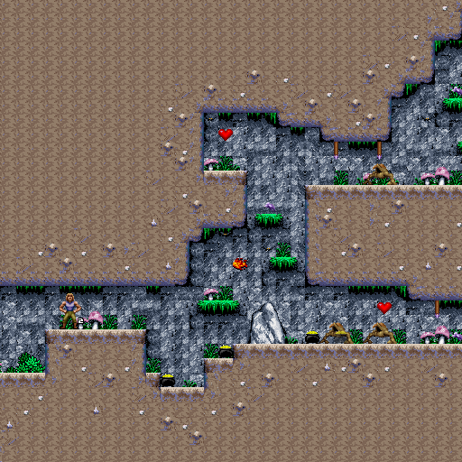
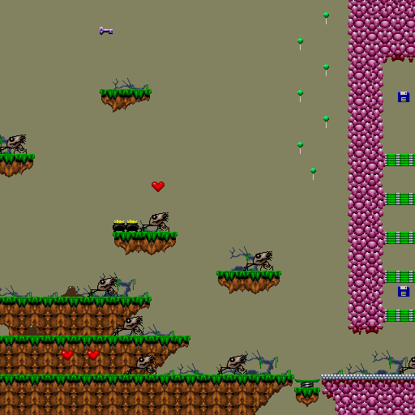
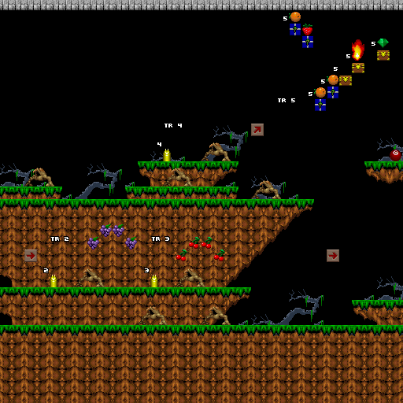
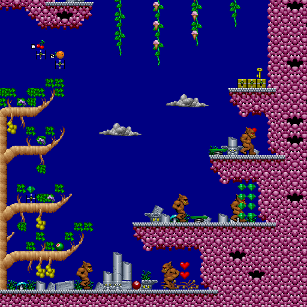

# Day 20 #

Good evening. From here on our things will likely be pretty 
straightforward. Stage 4 just has one new sprite to identify, which 
appears to be a simple bat enemy. Yes, another small hard-to-see enemy. 
See if you can find them in the image below:

Stage 5 has one new enemy (some sort of goopy creature) and a new 
palette:

Stage 6 has a new trap and a new treasure box type (containing a red 
key no less).

The next two stages I did out of order. Stage 8 just has one new 
treasure box (yellow key):

And Stage 7 I will get to tomorrow. [day20.zip][day20] is available.

[day20]: http://www.zerker.ca/misc/xargon/day20.zip
