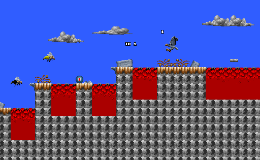
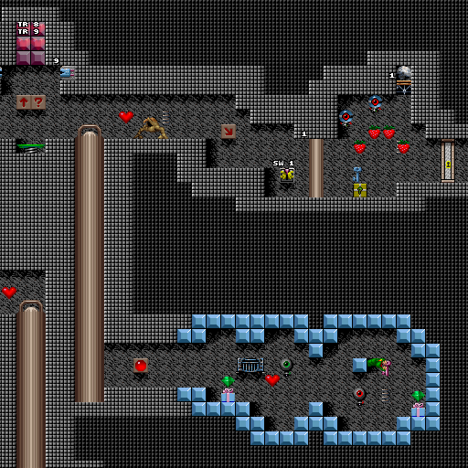
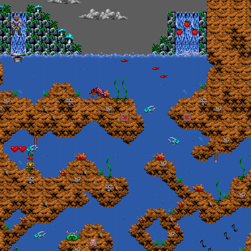
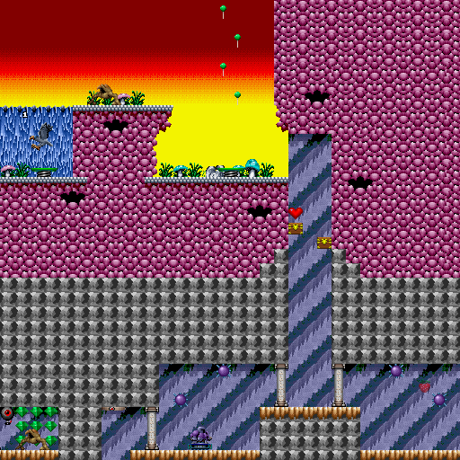

# Day 21 #

Hello folks. Time for more maps. Things are getting easier and easier 
as we go along. Soon everything will be done for us before we even 
start.

But not stage 7. It has ONE identified sprite, which is just the Eagle 
character again. And a new palette.



Stage 9 has a few new things. We've got another illusionary wall, more 
spikey trap guys, a blue key treasure box, and a variant of the bouncy 
ball trap. The latter I need to switch over to using varients so I can 
update this accordingly.

```py
# Bouncing Balls:
for i in range(2):
    self.addsprite(46, i, variablesprite({
        0 : graphics.records[51].images[4],
        3 : graphics.records[51].images[7]},
        field='info', hidelabel=True))
```

Oh, and I may as well fill in the Green Key treasure box, since all 
four keys appear to be in order.



I'm playing stages out-of-order again. Stage 11 has an alternate 
palette and one new ID for the same spike spear we've already seen. I 
also realize that I screwed up the shrimp monster, which also appears 
in Episode 1. I've re-uploaded the fixed copy to my site and get it 
corrected here after I finish Episode 2 (to make sure we didn't miss 
anything else).



And Stage 10 just has a different palette, an epic disk in a treasure 
box and ANOTHER version of the eagle sprite. I think I'm just going to 
assume all his variants are the same and populate via a loop:

```py
# Silvertongue
for i in range (25):
    self.addsprite(23, i, sprite(graphics.records[45].images[1]))
```



[day21.zip][day21] is available.

[day21]: http://www.zerker.ca/misc/xargon/day21.zip
