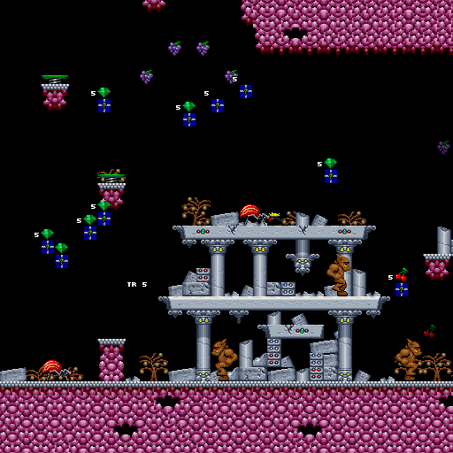
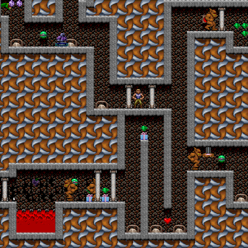
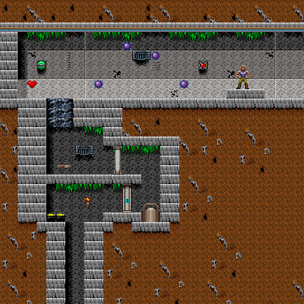
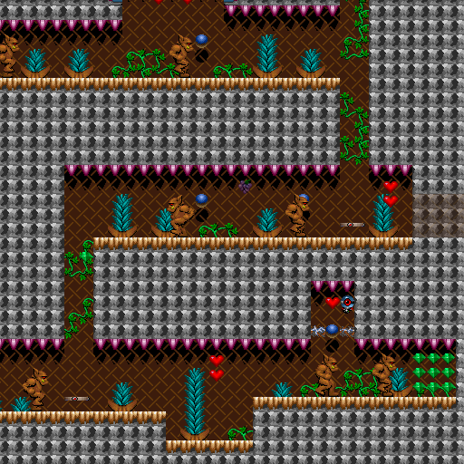
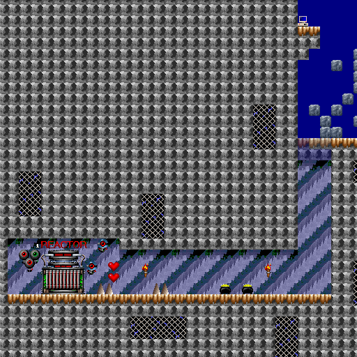

# Day 22 #

Another day, more maps. Today, I play Stage 12 only to discover it's 
already fully mapped:



Same with stage 13:



And 14:



And 15 (once I selected the correct palette):



See what I mean about things becoming easier? Now, there's one new 
sprite in the reactor level (stage 32), and that's for the larger 
reactor:



However, there's also misaligned text again for the ending sequence, so 
I'm going to need to do the same trick as with the Episode 1 Story 
scene:

```py
# String adjust for Episode 2 Ending:
if mapdata.name.upper() == 'BOARD_32' and mapdata.epnum == 2:
    blank = mapdata.stringlookup[-1]

    del mapdata.stringlookup[-1]
    mapdata.stringlookup.insert(8, blank)
```

And with that, Episode 2 is complete! I'll post it on my site tomorrow.

[day22.zip][day22] is available.

[day22]: http://www.zerker.ca/misc/xargon/day22.zip
