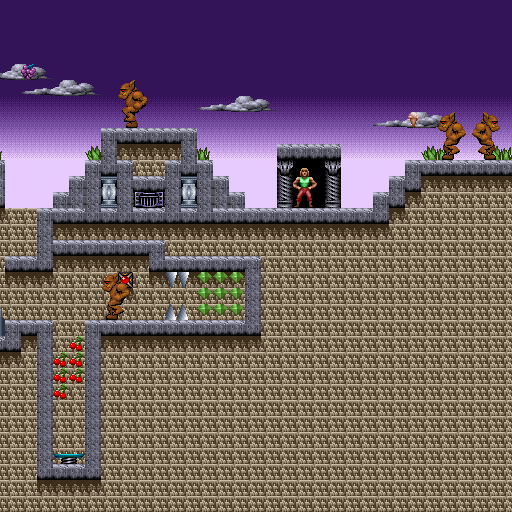
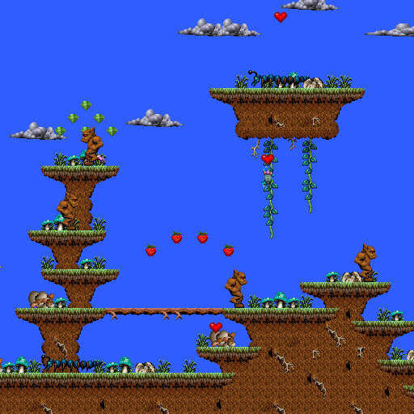
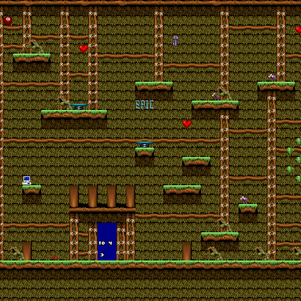

# Day 23 #

[Episode 2 is now posted on my web site][ep2], and submitted to VGMaps. 
I also submitted the correction to Episode 1.

Episode 3 time. The first task we need to do is fix THIS error when 
generating the Episode 3 maps:

```
Generating Map 'BOARD_01'
Traceback (most recent call last):
  File "xargonmapper.py", line 139, in <module>
    mapper = xargonmapper(xargonimages, tiledata, themap)
  File "xargonmapper.py", line 66, in __init__
    sprites = spritedb(graphics, mapdata.epnum)
  File "/data/Projects/Xargon/spritedb.py", line 247, in __init__
    self.addsprite(56, 0, sprite(graphics.records[46].images[2]))
IndexError: list index out of range
```

Looks to me like that slime creature is an Episode 2 exclusive. So 
let's change that:

```py
if epnum == 2:
    # Goo Monster
    self.addsprite(56, 0, sprite(graphics.records[46].images[2]))
```

Then it looks like we just need to add keys 1 and 2 for the bouncing 
ball trap. I will use debug images for now until we ID them:

```py
# Bouncing Balls:
for i in range(2):
    self.addsprite(46, i, variablesprite({
        0 : graphics.records[51].images[4],
        1 : graphics.debugimage(46, 'T1', 32, 16),
        2 : graphics.debugimage(46, 'T2', 32, 16),
        3 : graphics.records[51].images[7]},
        field='info', hidelabel=True))
```

After that, it looks like the first three stages are all identified, 
excluding their palettes. Let's add a few more entries to our palette 
list and finish those up:





And that's all for today. [day23.zip][day23] is available.

[ep2]: https://zerker.ca/home/xargon-episode-2-maps.html
[day23]: http://www.zerker.ca/misc/xargon/day23.zip

