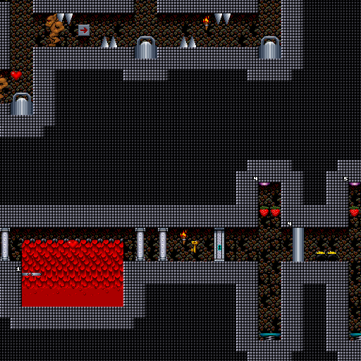
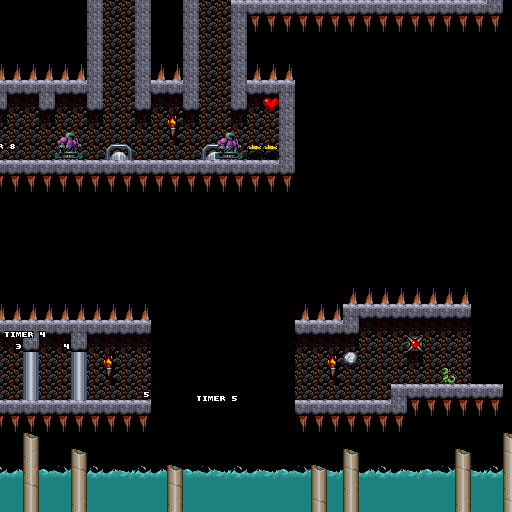
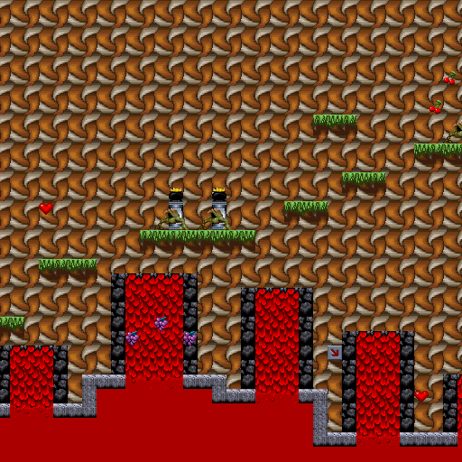
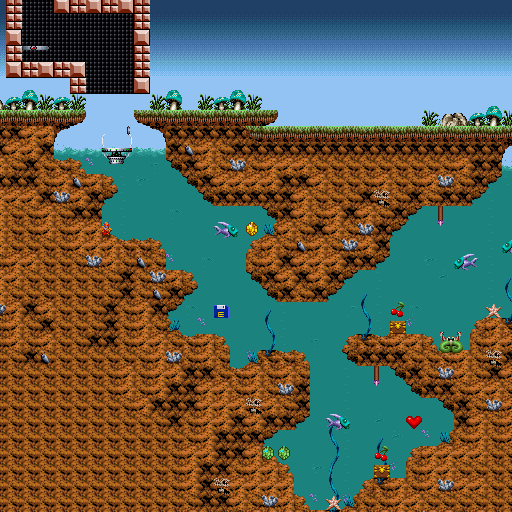
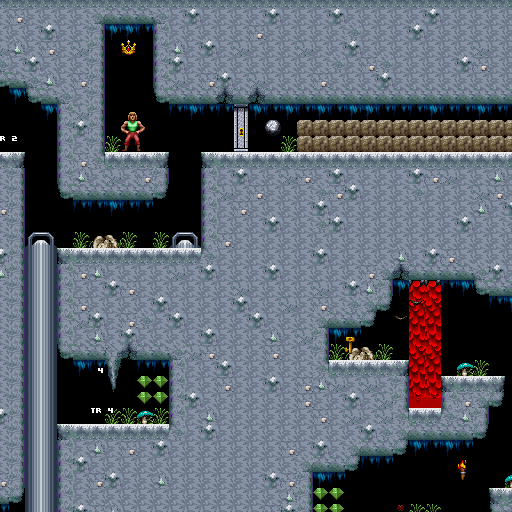

# Day 24 #

Good evening. There's not a whole lot left, so this is pretty much 
turning into a daily progress report until I finish. Almost all of the 
interesting stuff is already done.

Today, I start with Stage 4, which has one new sprite in the ceiling. 
It appears to be a ceiling switch of some sort:



Also, I died far too many times in that damn lava pit.

And I'm out of order again. Stage 6 appears to have some timers for 
periodically triggered events, so I will draw them by adding a prefix 
to their label number and make them otherwise invisible:

```py
# Timers:
for i in [30, 40, 50, 60]:
    self.addsprite(73, i, sprite(graphics.records[30].images[19],
        labelpref="Timer ", labeloffs = (-4, 4)) )
```



Stages 5, 7 and 8 are fully identified. I just needed to find the right 
palette, and voila:





[day24.zip][day24] is available.

[day24]: http://www.zerker.ca/misc/xargon/day24.zip

