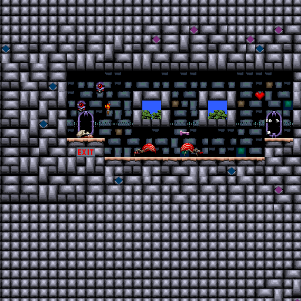

# Day 25 #

Good Morning. Time for a bit more Episode 3. Stage 9 sees the return of 
those cloak guys from the last level of Episode 1, be it with a 
different number:


Stage 10 was fully mapped, but it also proved the value of the doorway 
identifiers when I was playing it:


Stage 11 has a few new sprites: some snake-like creature, a new pickup 
gem, a new variant of the bouncing balls, high-jump boots in a treasure 
box, and a new invisible platform. And a different palette. Nothing we 
haven't already done.


Stage 13 is the demo stage, and just needs a new palette to finish it 
off:


Stage 12 just needed us to select the correct palette and...


Augh! No! Wrong! Guess the palette isn't *quite* identical to the 
earlier stage. Let's use a screenshot from this stage directly:



Better.

Next up is Xargon's Castle, i.e. the last set of levels. I will do that 
tomorrow. However, I can at least fill in the correct sprites for the 
map image:


Some assembly required? Let's see if we can't get the alignment on some 
of these sprites fixed up. After a few attempts, and some careful 
examination of a screenshot, here's what I came up with:

```py
# Xargon's castle:
if epnum == 3:
    self.addsprite(88, 7,  sprite(graphics.records[47].images[25], yoffs=6, xoffs=4))
    self.addsprite(88, 8,  sprite(graphics.records[47].images[26], yoffs=6, xoffs=10))
    self.addsprite(88, 9,  sprite(graphics.records[47].images[27]))
    self.addsprite(88, 10, sprite(graphics.records[47].images[28], xoffs=4))
    self.addsprite(88, 11, sprite(graphics.records[47].images[29], xoffs=10))
    self.addsprite(88, 12, sprite(graphics.records[47].images[30]))
```


[day25.zip][day25] is available.

[day25]: http://www.zerker.ca/misc/xargon/day25.zip
