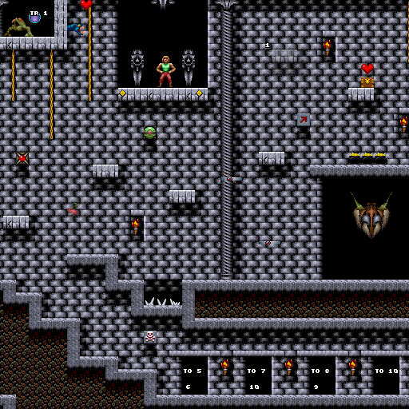
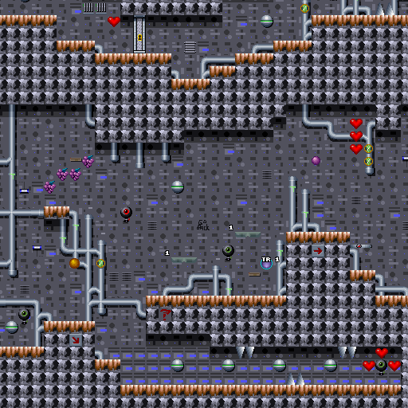
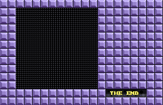
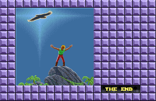

# Day 26 #

Hello again. Today we finish Episode 3 of Xargon, and thus the entire 
game. The first thing I need to do is play the last few levels with an 
eye to what is missing in the maps, and take screenshots of each so I 
don't forget. Since I can't save between levels, I'm going to just 
finish the game in one go then go back and update the maps.

And I finished the game. Now, Stage 14 is the castle stage, and it 
actually only has one missing sprite: another toggle platform. Let me 
add it now. Since it has a shadow when it appears (even on the right 
side), I'm going to create it as a 48 x 32 image and also include the 
shadow:

```py
4: graphics.semitransparent(
   graphics.compositeimage((48, 32), [(0, 0, 11, 1),
   (16, 0, 11, 1), (0, 16, 11, 2), (16, 16, 11, 2),
   (32, 0, 11, 19), (32, 16, 11, 19)]), 128),
```



However, there appears to be a hidden rapid fire over one of the flame 
spitters, which as far as I can tell, is not there. This looks like the 
same issue as the ice cream cone thing. I suspect the "mapping" based 
on the variant field has priority over the subtype when this behaves as 
an ordinary hidden item. Since this is the only alternate case I have 
come across, I will simply add it as a special entry in the sprite DB:

```py
for i in range(2):
    self.addsprite(73, i, variablesprite({
        0 : graphics.records[30].images[19],
        1 : graphics.records[30].images[19],
        2 : graphics.records[30].images[19],
        3 : graphics.compositeimage((32, 32), [(0, 0, 59, 1),
           (16, 0, 59, 4), (8, 12, 59, 1)]),
        4 : graphics.semitransparent(
            graphics.records[37].images[i], 128),
        ...
```

Stage 15 only has one new type of bouncing ball, after which it is 
complete:



The boss & ending stage, Stage 32, has one new sprite for a slug 
spawner, so we'll clump a couple slugs together for this (also, we need 
to account for the fact that slugs aren't in Episode 2):

```py
if epnum != 2:
    slugspawner = graphics.compositeimage((32, 14),
            [(2, 0, 62, 2), (-3, 0, 62, 0)])
else:
    slugspawner = graphics.records[30].images[19]

...

5 : slugspawner,
```

Incidentally, Xargon was already identified from the Episode 1 ending. 
However, the ending picture doesn't show up at all!



Let's look into this further; Going through the entire set of sprites 
for this map, I can't see anything that looks like it would trigger the 
ending image. Everything is fairly well identified. The last column in 
the unidentified header region has the number 143, which is unique. I 
can only theorize that this must be some special function to draw the 
ending image. Therefore, we will just have to do it the hard way.

First thing, I'm going to take advantage of my composite sprite code to 
make up a fake sprite that does not appear in the game to contain the 
full image. Looking through the graphics output, it appears to be 
stored in record 57 as 100 16 x 16 pixel chunks (i.e. 10 x 10). Let's 
put this together:

```py
# Fake sprite for the ending scene (which does not appear to have a sprite OR use Tiles):
tilelist = []
for x in range(10):
    for y in range(10):
        tilelist.append( (x*16, y*16, 57, x + 10*y) )
self.addsprite(1000, 0, sprite(graphics.compositeimage((160, 160), tilelist)))
```

Then we need to go into GIMP and find out the exact upper-left corner. 
With that determined, we can add this fake sprite to the end of the 
sprite list for Episode 3, Stage 32:

```py
# Fake Sprite for Episode 3 Ending:
if mapdata.name.upper() == 'BOARD_32' and mapdata.epnum == 3:
    mapdata.sprites.append(objrecord( (1000, 48, 240, 0, 0, 160, 160,
        0, 0, 0, 0, 0, 0, 0, 0) ))
```

That worked:



And that's it. The complete game is mapped. I have posted [the Episode 3 
maps on my web site][ep3] and submitted them to VGMaps. The only thing 
remaining (for me) is to do a bit more code cleanup and documentation 
before I release the tool "officially".

[day26.zip][day26] is available if you want to see the complete tool "as-is".

[ep3]: https://zerker.ca/home/xargon-episode-3-maps.html
[day26]: http://www.zerker.ca/misc/xargon/day26.zip
