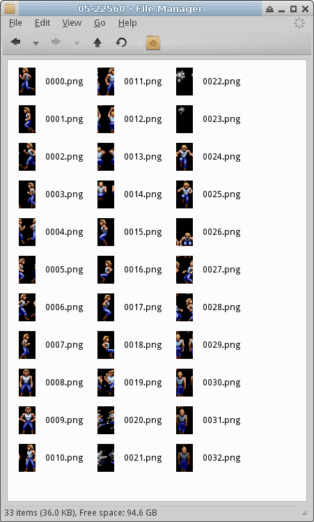
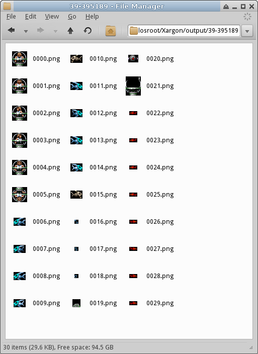

# Day 3 #

For today's effort, let's try to see if we can get better decoding of
each image record. It may not be perfect, but we should be able to get
good-enough decoding to get the map tiles ready for use. It's very hard
to guess what every number might mean from a black box perspective, so
some of those fields will just have to remain unknowns for now. Usually,
the best approach is to start with a number that you think should be
present and try to find it.

The most likely candidates I see are the 3rd and 4th last numbers. Since
we know the tile images are 16 x 16, we see a lot of records with those
numbers. What I'm going to do is split each record up into a series of
images, using those dimensions for each series. We'll see how well that
turns out. I'm also going to need to clean up my code a bit more to
support this, so it's time to group things into classes. The updated
script is below:


```py
import struct, sys, os, pdb, csv
from PIL import Image

def createpath(pathname):
    """ Simple utility method for creating a path only if it does
    not already exist.
    """
    if not os.path.exists(pathname):
        os.mkdir(pathname)

class imagefile(object):
    def __init__(self, filename, palette):
        filesize = os.path.getsize(filename)
        graphicsfile = open(filename, 'rb')

        header = '<62L'
        headerdata = struct.unpack(header,
            graphicsfile.read(struct.calcsize(header)) )

        graphicsfile.seek(0x200)

        header2 = '<62H'
        headerdata2 = struct.unpack(header2,
            graphicsfile.read(struct.calcsize(header2)) )

        # Create the image records using list comprehension
        self.records = [imagerecord(graphicsfile, offset, size, palette)
            for (offset, size) in zip(headerdata, headerdata2) if offset > 0]

    def debug_csv(self, filename):
        with open(filename, 'wb') as csvfile:
            writer = csv.writer(csvfile)
            for recnum, record in enumerate(self.records):
                writer.writerow([recnum, record.offset, record.size] + list(record.header))

    def save(self, outpath):
        createpath(outpath)
        for recnum, record in enumerate(self.records):
            record.save(os.path.join(outpath, '{:02}-{}'.format(recnum, record.offset)))


class imagerecord(object):
    def __init__(self, filedata, offset, size, palette):
        self.offset = offset
        self.size = size

        filedata.seek(offset)
        headerstruct = '<16B'
        self.header = struct.unpack(headerstruct,
            filedata.read(struct.calcsize(headerstruct)) )

        self.width = self.header[12]
        self.height = self.header[13]

        self.images = []

        for tilenum in range(size/(self.width*self.height)):
            tile = Image.fromstring("P", (self.width, self.height),
                filedata.read(self.width*self.height))
            tile.putpalette(palette)
            self.images.append(tile)


    def save(self, outpath):
        createpath(outpath)
        for tilenum, tile in enumerate(self.images):
            tile.save(os.path.join(outpath, '{:04}.png'.format(tilenum)) )


if __name__ == "__main__":
    if len(sys.argv) < 2:
        print """Usage: python xargongraphics.py [Graphics File]
TODO
"""
    else:
        # Use the screenshot to grab the proper colour palette:
        palimage = Image.open('screeny.png')
        palette = palimage.getpalette()

        for filename in sys.argv[1:]:
            xargonimages = imagefile(filename, palette)
            xargonimages.debug_csv('debug.csv')
            xargonimages.save('output')
```

So now we have an imagefile class for the overall file, and an
imagerecord for each record in the file's table of contents. I also
moved my save CSV code and load/save image code into functions for each
class.

Anyone unfamiliar with [zip, 
enumerate](http://docs.python.org/2/library/functions.html) or [Python 
classes in general](http://docs.python.org/2/tutorial/classes.html) can 
refer to the corresponding Python documentation sections linked for 
each. I used one yesterday, but if you are unfamiliar with [list 
comprehensions](http://docs.python.org/2/tutorial/datastructures.html#list-comprehensions), 
I recommend looking that up too. I'm sure I'll use more going forward.

The first few sets of images start to look more like something, but
they're still a bit weird. Set #5, however, is where things start to
get interesting. Here we have an almost-correct decoding of the player
sprite!



Guess the guess wasn't too far off. Since we're shifting between each
sub-image, I suspect there may be a small header between each image.
Let's see what we can find. I'm going to use image set #9, because
it's 16 by 16 and very easy to see image alignment. The first image
seems to be shifted by 1 pixel, and the the second image seems to be
shifted by 2 pixels. Hrm. 3 pixel header? Let's find this in a hex
editor. My debug code nicely names the directories by their offsets, so
start from offset 74973 + 16 for header + 256 for first image -1 for
first image error gets me to 75244. And this decodes to:
16 16 0

So, it looks like the end of the previous header was actually the start
of the first image's header. And it also appears I was accidentally
grabbing the first pixel from the image. Let's go fix all this, and
decode the headers for each image. Also, looking at record 9, I ended up
with 47 images. The header for that record has 47 as the first number.
Since I know now that we can have variable size images, I'm going to
assume this is the number of images in a record.

On my first attempt, I got the following exception

```
Traceback (most recent call last):
  File "xargongraphics.py", line 100, in <module>
    xargonimages = imagefile(filename, palette)
  File "xargongraphics.py", line 46, in __init__
    for (offset, size) in zip(headerdata, headerdata2) if offset > 0]
  File "xargongraphics.py", line 78, in __init__
    filedata.read(width*height))
  File "/usr/lib/python2.7/dist-packages/PIL/Image.py", line 1797, in fromstring
    im.fromstring(data, decoder_name, args)
  File "/usr/lib/python2.7/dist-packages/PIL/Image.py", line 590, in fromstring
    d.setimage(self.im)
ValueError: tile cannot extend outside image
```

Which implies something is mixed up. Debugger time.

```
-> tile = Image.fromstring("P", (width, height),
(Pdb) width
1
(Pdb) height
0
(Pdb) self.header
(128, 1, 0, 0, 10, 0, 18, 0, 34, 2)
(Pdb)
```

Oops. I think I subtracted too many bytes when I shrunk the header.
Here's the code with that fixed.

```py
import struct, sys, os, pdb, csv
from PIL import Image

def createpath(pathname):
    """ Simple utility method for creating a path only if it does
    not already exist.
    """
    if not os.path.exists(pathname):
        os.mkdir(pathname)

class imagefile(object):
    def __init__(self, filename, palette):
        filesize = os.path.getsize(filename)
        graphicsfile = open(filename, 'rb')

        header = '<62L'
        headerdata = struct.unpack(header,
            graphicsfile.read(struct.calcsize(header)) )

        graphicsfile.seek(0x200)

        header2 = '<62H'
        headerdata2 = struct.unpack(header2,
            graphicsfile.read(struct.calcsize(header2)) )

        # Create the image records using list comprehension
        self.records = [imagerecord(graphicsfile, offset, size, palette)
            for (offset, size) in zip(headerdata, headerdata2) if offset > 0]

    def debug_csv(self, filename):
        with open(filename, 'wb') as csvfile:
            writer = csv.writer(csvfile)
            for recnum, record in enumerate(self.records):
                writer.writerow([recnum, record.offset, record.size] + list(record.header))

    def save(self, outpath):
        createpath(outpath)
        for recnum, record in enumerate(self.records):
            record.save(os.path.join(outpath, '{:02}-{}'.format(recnum, record.offset)))


class imagerecord(object):
    def __init__(self, filedata, offset, size, palette):
        self.offset = offset
        self.size = size

        filedata.seek(offset)
        headerstruct = '<12B'
        self.header = struct.unpack(headerstruct,
            filedata.read(struct.calcsize(headerstruct)) )

        self.numimages = self.header[0]
        self.images = []

        for tilenum in range(self.numimages):
            (width, height, unknown) = struct.unpack('<3B',
                filedata.read(3))

            tile = Image.fromstring("P", (width, height),
                filedata.read(width*height))
            tile.putpalette(palette)
            self.images.append(tile)


    def save(self, outpath):
        createpath(outpath)
        for tilenum, tile in enumerate(self.images):
            tile.save(os.path.join(outpath, '{:04}.png'.format(tilenum)) )


if __name__ == "__main__":
    if len(sys.argv) < 2:
        print """Usage: python xargongraphics.py [Graphics File]
TODO
"""
    else:
        # Use the screenshot to grab the proper colour palette:
        palimage = Image.open('screeny.png')
        palette = palimage.getpalette()

        for filename in sys.argv[1:]:
            xargonimages = imagefile(filename, palette)
            xargonimages.debug_csv('debug.csv')
            xargonimages.save('output')
```


And the output for a random record with variable-sized images:



Nailed it!

Now, to top things off, let's mask transparent areas of sprites. It
looks like colour 0 (black) is used for transparency. Let's just add a
routine to loop through the image data, create a mask, then convert each
to RGBA. This will make our lives much easier going forward. I'm
actually going to just copy a routine I already wrote for my Shadow
Caster maps.

And done...

```py
import struct, sys, os, pdb, csv
from PIL import Image

def createpath(pathname):
    """ Simple utility method for creating a path only if it does
    not already exist.
    """
    if not os.path.exists(pathname):
        os.mkdir(pathname)

class imagefile(object):
    def __init__(self, filename, palette):
        filesize = os.path.getsize(filename)
        graphicsfile = open(filename, 'rb')

        header = '<62L'
        headerdata = struct.unpack(header,
            graphicsfile.read(struct.calcsize(header)) )

        graphicsfile.seek(0x200)

        header2 = '<62H'
        headerdata2 = struct.unpack(header2,
            graphicsfile.read(struct.calcsize(header2)) )

        # Create the image records using list comprehension
        self.records = [imagerecord(graphicsfile, offset, size, palette)
            for (offset, size) in zip(headerdata, headerdata2) if offset > 0]

    def debug_csv(self, filename):
        with open(filename, 'wb') as csvfile:
            writer = csv.writer(csvfile)
            for recnum, record in enumerate(self.records):
                writer.writerow([recnum, record.offset, record.size] + list(record.header))

    def save(self, outpath):
        createpath(outpath)
        for recnum, record in enumerate(self.records):
            record.save(os.path.join(outpath, '{:02}-{}'.format(recnum, record.offset)))


class imagerecord(object):

    @staticmethod
    def maskimage(inimage):
        """ Masks colour 0 in the given image, turning those pixels
        transparent. Returns the resulting RGBA image.
        """
        tempmask = Image.new('L', inimage.size, 255)
        maskdata = list(tempmask.getdata())
        outimage = inimage.convert("RGBA")

        for pos, value in enumerate(inimage.getdata()):
            if value == 0:
                maskdata[pos] = 0

        tempmask.putdata(maskdata)
        outimage.putalpha(tempmask)
        return outimage

    def __init__(self, filedata, offset, size, palette):
        self.offset = offset
        self.size = size

        filedata.seek(offset)
        headerstruct = '<12B'
        self.header = struct.unpack(headerstruct,
            filedata.read(struct.calcsize(headerstruct)) )

        self.numimages = self.header[0]
        self.images = []

        for tilenum in range(self.numimages):
            (width, height, unknown) = struct.unpack('<3B',
                filedata.read(3))

            tile = Image.fromstring("P", (width, height),
                filedata.read(width*height))
            tile.putpalette(palette)
            self.images.append(self.maskimage(tile))


    def save(self, outpath):
        createpath(outpath)
        for tilenum, tile in enumerate(self.images):
            tile.save(os.path.join(outpath, '{:04}.png'.format(tilenum)) )


if __name__ == "__main__":
    if len(sys.argv) < 2:
        print """Usage: python xargongraphics.py [Graphics File]
TODO
"""
    else:
        # Use the screenshot to grab the proper colour palette:
        palimage = Image.open('screeny.png')
        palette = palimage.getpalette()

        for filename in sys.argv[1:]:
            xargonimages = imagefile(filename, palette)
            xargonimages.debug_csv('debug.csv')
            xargonimages.save('output')
```
