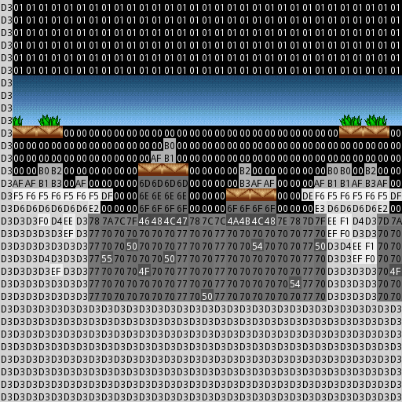

# Day 5 #

On to Day 5: the day where I stop teasing and actually create a map.

To support this, we need to start a lookup routine in the graphics file 
to get the corresponding tile for a map tile index. Unfortunately, we 
don't know the mapping yet, so we need to pre-populate with debug 
tiles. Since we found out that the tile index is only an 8-bit number, 
we should be able to fit it (in hex notation) in the 16 x 16 pixel 
debug tile. This may make the CSV we made obsolete, but what can you 
do.

We need a font to generate the text, so I'm going to copy in the 
Android favourite, DroidSans. Here's the routine to create a simple 
debug tile (adapted from my Shadow Caster mapper) and the font 
declaration:

```py
debugfont = ImageFont.truetype("DroidSans.ttf", 12)

@staticmethod
def debugimage(colour, text):
    """ Creates a 16x16 debug image for tiles:

    colour -- the background colour for the image.
    text -- the text to display
    """
    tempimage = Image.new("RGBA", (16, 16), colour)
    textcolor = (255, 255, 255) if colour[0] < 96 else (0, 0, 0)
    pen = ImageDraw.Draw(tempimage)
    pen.text((1, 2), text, font=imagefile.debugfont, fill=textcolor)
    return tempimage
```

Here's the addition to the __init__ method for the graphics file:

```py
# Group by map tile:
self.tilelookup = [self.debugimage( (i, i, i), '{:02X}'.format(i) )
    for i in range(256) ]

And the lookup method, which will change once we figure out real mappings:
Code:
def gettile(self, tilenum):
    return self.tilelookup(tilenum)
```

Now, we start a new file for generating the map. In this file, we're 
going to import the other two files we wrote in order to use their 
features in tandem. This will start out extremely simple: we will 
create a large Image object to hold the map, then paste every debug 
tile according to its coordinates. Since the map is a linear set of 
tiles, we need to use integer division and modulus (i.e. the 
"remainder") to split that up into X, Y coordinates.

Here's the initial mapper file. I set up the mapper as a class, but you 
can do it as a standalone set of functions as well. Personally, I like 
to split it up into phases. the Shadow Caster had initialize, generate 
and save phases, but I think we can combine the first two in this case.

```py
import sys
from PIL import Image
from xargonmap import xargonmap
from xargongraphics import imagefile

class xargonmapper(object):
    def __init__(self, graphics, mapdata):
        self.mappicture = Image.new("RGB", (128*16, 64*16) )
        self.name = mapdata.name

        for index, tileval in enumerate(mapdata.tiles):
            # Remember: maps are height first
            (x, y) = (index/64, index%64)
            self.mappicture.paste(graphics.gettile(tileval),
                (x*16, y*16) )

    def save(self):
        self.mappicture.save(self.name + '.png')


if __name__ == "__main__":
    if len(sys.argv) < 3:
        print """Usage: python xargonmapper.py [Graphics File] [Map File(s)...]
TODO
"""
    else:
        xargonimages = imagefile(sys.argv[1])
        for filename in sys.argv[2:]:
            themap = xargonmap(filename)

            print "Generating Map '{}'".format(themap.name)
            mapper = xargonmapper(xargonimages, themap)
            print "Saving Map '{}'".format(themap.name)
            mapper.save()
```

And here's our first output with no tiles identified:


Remember this screenshot from Day 2?


Well, that's same area. So now we need to go look through our extracted 
tiles and match a few to IDs. Usually we can figure out a trend to 
unlock the rest for us; otherwise it can become a bit tedious. I see a 
few tiles in graphics record #8, so I'm going to go ahead and map 
those. Actually, I already see a pattern: it looks like map tile values 
1 to at least 0A correspond to the first few tiles in group 8. But 
there appears to be a discontinuity at index 6. GRR. Let's do what we 
can with it.

```py
    def gettile(self, tilenum):
        if tilenum >= 2 and tilenum <=5:
            return self.records[8].images[tilenum-2]
        elif tilenum >= 7 and tilenum <=10:
            return self.records[8].images[tilenum-3]
        else:
            return self.tilelookup[tilenum]
```

Not too bad so far, but I can see this getting awkward after a bit. 
Let's see what this does to the map:



Okay, that's progress. Now let me go ahead and try to identify some of 
the other tiles... gah, what is that??


Looks like I was wrong about the 8-bit tiles. This all falls under the 
red area in the original visualisations. Looking a bit closer at my 
grayscale meta files in GIMP show that even the non-black regions 
appear to have a few very-close-but-not-identical colour values. Time 
so switch back to 16-bit tiles (grumble). I'm not quite sure how to 
make 4-digits visible on a 16 pixel tile though. I'll try, but I may 
need to rely more on the CSV.

```py
debugfont = ImageFont.truetype("DroidSans.ttf", 8)

@staticmethod
def debugimage(index):
    """ Creates a 16x16 debug image for tiles """
    colour = (index%256, index/256, 0)
    tempimage = Image.new("RGBA", (16, 16), colour)
    textcolor = (255, 255, 255) if colour[0] < 96 and colour[1] < 96 else (0, 0, 0)
    pen = ImageDraw.Draw(tempimage)
    pen.text((4, 0), '{:02X}'.format(index/256), font=imagefile.debugfont, fill=textcolor)
    pen.text((4, 8), '{:02X}'.format(index%256), font=imagefile.debugfont, fill=textcolor)
    return tempimage
```

8-point font FTW. Just readable. It takes a noticeable delay to 
generate 65535 debug tiles though Sad. Now to adapt my previous 
identifications (+ a couple more):

```py
def gettile(self, tilenum):
    if tilenum == 0xC000:
        return self.records[9].images[15]
    elif tilenum == 0xC001:
        return self.records[8].images[24]
    elif tilenum >= 0xC002 and tilenum <=0xC005:
        return self.records[8].images[tilenum-0xC002]
    elif tilenum >= 0xC007 and tilenum <=0xC00A:
        return self.records[8].images[tilenum-0xC003]
    elif tilenum >= 0xC1AF and tilenum <=0xC1B3:
        return self.records[14].images[tilenum-0xC1AF+18]
    elif tilenum >= 0xC0F5 and tilenum <=0xC0F6:
        return self.records[25].images[tilenum-0xC0F5+2]
    elif tilenum >= 0xC0D3 and tilenum <=0xC0D6:
        return self.records[25].images[tilenum-0xC0D3+9]
    elif tilenum >= 0xC2DE and tilenum <=0xC2DF:
        return self.records[25].images[tilenum-0xC2DE+13]
    elif tilenum >= 0xC2E2 and tilenum <=0xC2E3:
        return self.records[25].images[tilenum-0xC2E2+19]
    elif tilenum >= 0xC2EE and tilenum <=0xC2F1:
        return self.records[25].images[tilenum-0xC2EE+31]
    else:
        return self.tilelookup[tilenum]
```


No more misidentified tiles, but we aren't exactly coming up with much 
of a trend, even if we were to calculate out the offsets (i.e. 
-0xC0F5+2 = -0xC0F3, but -0xC0D3+9 = -0xC0CA). It seems that almost 
every group of tiles, even those in the same record, ends up 
discontinuous. At this point, we have two options. Either keep 
identifying tiles manually (and up with some sort of mapping database), 
or see if there is some information we are missing. Hey now, there's a 
file called TILES.XR1. Let's see what's in it. Looks like a whole bunch 
of strings with some supplementary information. It's a very regular 
file, so it should be fairly simple to decode.


Here's the last record in the file (with ASCII characters substituting 
the obvious text portion):

    81 03 3A 5B 01 00 07 MPBRDG1

The last byte appears to be the string length, so it's just the first 6 
to guess about. Since we are dealing with 16-bit tile values, I'm going 
to decode each of these at 16 bits on a hunch.

Here's our new file:

```py
import struct, sys, os, pdb, csv
from PIL import Image, ImageFont, ImageDraw

class tilefile(object):
    debugfont = ImageFont.truetype("DroidSans.ttf", 8)

    def __init__(self, filename):
        filesize = os.path.getsize(filename)
        infile = open(filename, 'rb')

        self.tiles = []

        commonheader = '<3HB'
        while infile.tell() < filesize:
            headerdata = struct.unpack(commonheader,
                infile.read(struct.calcsize(commonheader)) )
            stringlen = headerdata[3]
            print headerdata
            self.tiles.append(headerdata[0:3] +
                struct.unpack('<{}s'.format(stringlen), infile.read(stringlen)) )

    def debug_csv(self, filename):
        with open(filename, 'wb') as csvfile:
            writer = csv.writer(csvfile)
            for recnum, tiledata in enumerate(self.tiles):
                writer.writerow((recnum,) + tiledata)


if __name__ == "__main__":
    if len(sys.argv) < 2:
        print """Usage: python xargontiles.py [Tiles File]
TODO
"""
    else:
        for filename in sys.argv[1:]:
            xargontiles = tilefile(filename)
            xargontiles.debug_csv('tiles.csv')
```

And part of the output. First column is the index in the file, the rest is data from the file:

```
0   0   18704   1   0
1   1   18432   1   SK1
2   2   18433   1   SK2
3   3   18434   1   SK3
4   4   18435   1   SK4
5   5   18436   1   SK5
6   6   18707   1   CLD1
7   7   18437   1   VL
8   8   18438   1   VR
9   9   18439   0   S1L
10  10  18440   0   S1R
11  11  18708   1   CLD2
12  12  18709   1   CLD3
13  13  18441   1   R1
14  14  18442   1   R2
15  15  18443   1   R3
16  16  18444   1   R4
17  17  18445   3   GS1
18  18  18446   3   GS2
19  19  18447   1   R5
20  20  18448   1   R6
21  21  18449   0   S2
22  22  18450   0   S2C
23  23  18451   0   S2M
24  24  18452   0   S2B
25  25  18453   1   S2U
26  26  18454   1   S2BK
27  27  18710   1   CLD4
28  28  18711   1   CLD5
29  29  18712   1   CLD6
```

Still no direct correlation to the values we see on the map, as C000 
(for example) is 49152 in decimal. Let me do one more thing today. I'm 
going to re-interpret some of our unknown GRAPHICS record header values 
as 16-bit numbers.

```
0   0   0
1   768     8591    128 1   2560    4608    8704    2   1   0
2   9359    5007    128 1   2048    3584    6656    2   1   0
3   14366   721     10  1   200     360     680     2   1   0
4   15087   6559    36  1   1744    3344    6544    8   4   0
5   21646   914     1   1   196     388     772     8   4   0
6   22560   32041   38  1   8122    16096   32032   8   0   0
7   54601   6880    27  1   1564    3020    5932    8   4   0
8   61481   6746    25  1   1700    3300    6500    8   4   0
9   68227   6746    25  1   1700    3300    6500    8   4   0
10  74973   12224   47  1   3196    6204    12220   8   4   0
11  87197   7523    28  1   1904    3696    7280    8   4   0
12  94720   3379    12  1   816     1584    3120    8   4   0
13  98099   3638    13  1   884     1716    3380    8   4   0
14  101737  22325   86  1   5848    11352   22360   8   4   0
15  124062  7264    27  1   1836    3564    7020    8   4   0
16  131326  8818    33  1   2244    4356    8580    8   4   0
17  140144  8041    30  1   2040    3960    7800    8   4   0
18  148185  7523    28  1   1904    3696    7280    8   4   0
19  155708  4674    17  1   1156    2244    4420    8   4   0
20  160382  3379    12  1   816     1584    3120    8   4   0
21  163761  7523    28  1   1904    3696    7280    8   4   0
22  171284  6746    25  1   1700    3300    6500    8   4   0
23  178030  19437   74  1   5032    9768    19240   8   4   0
24  197467  7264    27  1   1836    3564    7020    8   4   0
25  204731  9595    36  1   2448    4752    9360    8   4   0
26  214326  20991   80  1   5440    10560   20800   8   4   0
27  235317  18401   70  1   4760    9240    18200   8   4   0
28  253718  8559    32  1   2176    4224    8320    8   4   0
29  262277  4415    16  1   1088    2112    4160    8   4   0
30  266692  30196   77  1   7901    15900   30680   8   0   0
31  296888  8523    36  1   2128    5392    8080    8   0   0
32  305411  4308    7   1   1036    2044    4060    8   0   0
33  309719  11437   12  1   2840    5652    11216   8   0   0
34  321156  4775    8   1   992     1952    3872    8   0   0
35  325931  17409   18  1   4572    9072    18072   8   0   0
36  343340  10454   37  1   2650    5236    10156   8   0   0
37  353794  9499    36  1   2360    4688    9008    8   0   0
38  363293  11650   7   1   2880    6144    11436   8   0   0
39  374943  20246   27  1   5249    11588   20672   8   0   0
40  395189  12425   30  1   3267    6444    12708   8   0   0
41  407614  8212    31  1   2108    4092    8060    8   4   0
42  0   0
43  415826  17605   18  1   4392    8712    17352   8   0   0
44  433431  6228    23  1   1564    3036    5980    8   4   0
45  439659  12263   8   1   3200    7072    12704   8   0   0
46  0   0
47  451922  21994   25  1   5640    11844   22260   8   0   0
48  473916  7311    16  1   1888    3904    7360    8   0   0
49  0   0
50  481227  4263    8   1   960     1888    3744    8   0   0
51  485490  3052    15  1   772     1572    2908    8   0   0
52  488542  2671    16  1   680     1328    2528    8   0   0
53  491213  62946   241 1   16516   32068   63172   8   4   0
54  554159  9301    10  1   2440    4840    9640    8   0   0
55  563460  2728    7   1   476     924     1820    8   0   0
56  566188  31447   24  1   7872    17376   31200   8   0   0
57  597635  31447   24  1   7872    17376   31200   8   0   0
58  629082  20958   21  1   4980    9876    19668   8   0   0
59  650040  12179   22  1   2826    6012    11040   8   0   0
60  662219  2209    6   1   504     1048    1944    8   0   0
61  664428  25423   16  1   6208    12352   24640   8   0   0
62  689851  7704    11  1   1616    3548    6332    8   0   0
```

Not really much better, is it? I did notice something of use, however. 
The second-last value appears to be a flag to indicate whether a record 
contains tile data (4), font data (1) or sprite data (0). That's 
something.

However, I tried something else. Looking at the TILES file, I sorted my 
output by the third column (the large number) and it appears that that 
corresponds to the position of a tile in the record file. I looked over 
some of the WATER tiles and compared them to record #23, and there 
appears to be a correlation there.

```
364 22272   24617   WATERFL1
365 22273   24617   WATERFL2
366 22274   24617   WATERFL3
367 22275   24617   WATERFL4
368 22276   24617   WATER0
369 22277   1       WATERFLS1
370 22278   1       WATERFLS2
371 22279   24617   WATERFLT
574 22280   24617   WATEREND1
575 22281   24617   WATEREND2
576 22282   24617   WATEREND3
577 22283   24617   WATEREND4
578 22284   24617   WATEREND5
579 22285   24617   WATEREND6
580 22286   24617   WATEREND7
581 22287   24617   WATEREND8
582 22288   24617   WATERMST1
583 22289   24617   WATERMST2
584 22290   24617   WATERMST3
585 22291   24617   WATERMST4
586 22292   24617   WATERMST5
587 22293   24617   WATERMST6
588 22294   24617   WATERMST7
589 22295   24617   WATERMST8
590 22296   24617   WATERWAV1
591 22297   24617   WATERWAV2
592 22298   24617   WATERWAV3
593 22299   24617   WATERWAV4
594 22300   24617   WATERWAV5
595 22301   24617   WATERWAV6
596 22302   24617   WATERWAV7
597 22303   24617   WATERWAV8
375 22304   24633   WATERBUBL
376 22312   24617   WATERT1
377 22313   24617   WATERT2
378 22314   24617   WATERT3
379 22315   24617   WATERT4
380 22316   24617   WATERT5
381 22317   24617   WATERT6
382 22318   24617   WATERT7
383 22319   24617   WATERT8
384 22320   24633   SEAWEEDR
385 22324   24633   SEAWEEDL
386 22328   24617   CORALVEGL
387 22329   24617   CORALVEGR
388 22330   24617   CORALTL
389 22331   0       CORALM
390 22332   24617   CORALTR
372 22333   24617   CORALBL
373 22334   24617   CORALBR
374 22335   0       ALGAEB
393 22336   24617   ALGAE1
394 22337   24617   ALGAE2
395 22338   24617   ALGAE3
396 22339   24617   ALGAE4
397 22340   0       CORALM2
398 22341   0       CORALM3
360 22342   0       CORALSHL
361 22343   0       CORALSHD
362 22344   0       CORALT
363 22345   0       CORALT2
```


So I did some more calculations with the area that appears to 
correspond to record 25 against my identified values:

```
217 245 22787   3   GRS1    C0F5    25  2   49152   22785
218 246 22788   3   GRS2    C0F6    25  3   49152   22785
219 247 22789   1   BMSH
220 248 22790   1   BMSHT
221 249 22791   1   BMSHB
691 754 22792   3   LIMB1
692 755 22793   3   LIMB2
183 211 22794   0   DRT1    C0D3    25  9   49152   22785
184 212 22795   1   DRT2    C0D4    25  10  49152   22785
185 213 22796   1   DRT3    C0D5    25  11  49152   22785
186 214 22797   0   DRT4    C0D6    25  12  49152   22785
695 758 22797   1   DRT4B           12      22785
671 734 22798   3   S6L     C2DE    25  13  49152   22785
672 735 22799   3   S6R     C2DF    25  14  49152   22785
187 215 22800   0   DRTBL           15      22785
188 216 22801   0   DRTBR           16      22785
673 736 22802   0   GRSL            17      22785
674 737 22803   0   GRSR            18      22785
675 738 22804   1   DRTUL   C2E2    25  19  49152   22785
676 739 22805   1   DRTUR   C2E3    25  20  49152   22785
677 740 22806   0   DRTL1           21      22785
693 756 22806   1   DRTL1B          21      22785
678 741 22807   0   DRTR1           22      22785
694 757 22807   1   DRTR1B          22      22785
679 742 22808   0   DRTL2           23      22785
680 743 22809   0   DRTR2           24      22785
681 744 22810   0   DRTB1           25      22785
682 745 22811   0   DRTB2           26      22785
683 746 22812   1   RT1             27      22785
684 747 22813   1   RT2             28      22785
685 748 22814   0   DRTB3           29      22785
686 749 22815   1   RT3             30      22785
687 750 22816   1   DRTRT1  C2EE    25  31  49152   22785
688 751 22817   1   DRTRT2  C2EF    25  32  49152   22785
689 752 22818   1   DRTRT3  C2F0    25  33  49152   22785
690 753 22819   1   DRTRT4  C2F1    25  34  49152   22785
```

There is definitely a correlation in both directions. Column 2 appears 
to be some equivalent of the tile ID in the map. Column 3 appears to be 
some equivalent of the tile ID in the GRAPHICS file. The 
manually-entered columns, in order, are: actual map tile ID, actual 
record group, actual record index, difference between column 2 and 
actual tile ID, difference between column 3 and actual record group. 
Notice the differences are constant for all the identified tiles in 
this region. Next session, we will look into the exact relationship 
across groups.

And finally, [day5.zip][day5] is available for anyone who wants it.

[day5]: http://www.zerker.ca/misc/xargon/day5.zip
