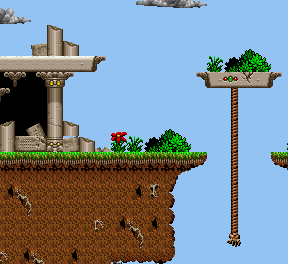

# Day 6 #

To start off today's exercise, I'm going to play around in a 
spreadsheet. Exciting stuff. Basically, for every known sprite thus 
far, I want to figure out the exact relationship between the TILES 
file, the Record ID, and the Map ID. One thing I noticed yesterday was 
that the Record ID column in the TILES file appeared to shift by a 256 
boundary for each record. We should be able to use the classic divide 
and modulus pair to split out the record number. I just need to confirm 
to make sure we don't start drifting for whatever offset I end up 
calculating.

Records appear to be easy. The record number is just the TILES entry / 
256 - 64, and the entry in the record is the TILES entry % 256 -1. The 
only two things that we need to pay special attention to are:

1) The "extra" tile we mentioned before (i.e. that I thought might be 
   garbage data) appears to be referred to by position -1. That said, 
   index -1 in Python already refers to the last element in a list, so we 
   don't actually need to handle this explicitly.

2) The tiles file refers to record 49, which does not exist. We will 
   just need to keep an eye out if this happens. I expect this is just 
   placeholder data (maybe for the registered version).

The Tile IDs appear to just be offset by C000, which is pretty simple. 
I'll need to figure out the tiles that are in the 0 to FF range on the 
map, but that can wait. I'll just put an IF statement to avoid 
processing them for now.

So let's expand our xargontiles.py file to do the lookup for us. We 
have two options for linking together the graphics and tile files:

1) Pass in the Graphics file when creating the Tiles file and store a 
   reference for future use

2) Pass in the Graphics file for the lookup operation to the Tiles file

Since I prefer to keep each class tailored to just the file it is 
responsible for, I will be doing the second option. The xargonmapper.py 
is the only file that will know about all the related files and will 
tie them together.

First, we need to set up xargontile to do easier lookups. I will expand 
the initialization routine to populate a dictionary of tile to record 
mappings:

```py
def __init__(self, filename):
    filesize = os.path.getsize(filename)
    infile = open(filename, 'rb')

    self.tiles = []
    self.lookup = {}

    commonheader = '<3HB'
    while infile.tell() < filesize:
        headerdata = struct.unpack(commonheader,
            infile.read(struct.calcsize(commonheader)) )
        stringlen = headerdata[3]
        self.tiles.append(headerdata[0:3] +
            struct.unpack('<{}s'.format(stringlen), infile.read(stringlen)) )

        self.lookup[headerdata[0]] = headerdata[1]
```

Then we write the lookup routine itself to use this lookup and take the 
offsets into account:

```py
def gettile(self, graphics, tilenum):
    if tilenum < 0xC000:
        return graphics.tilelookup[tilenum]
    else:
        graphindex = self.lookup[tilenum - 0xC000]

        recnum = graphindex / 256 - 64
        recindex = graphindex % 256 - 1

        return graphics.records[recnum].images[recindex]

And this results in a very minor change to xargonmapper:
Code:
def __init__(self, graphics, tiledata, mapdata):
    self.mappicture = Image.new("RGB", (128*16, 64*16) )
    self.name = mapdata.name

    for index, tileval in enumerate(mapdata.tiles):
        # Remember: maps are height first
        (x, y) = (index/64, index%64)
        self.mappicture.paste(tiledata.gettile(graphics, tileval),
            (x*16, y*16) )
```

Then we run it!


And would you look at that? THAT is progress. But it's not perfect, and 
it has some glitches we need to investigate. Notably, we haven't looked 
into the map index 0 -> FF area yet. I also noticed a couple glitches 
over in this part of the map which we need to investigate further:


But first, the region that doesn't start with C000:


And let's start identifying some tiles. I already have a theory that 
these are simply direct indicies into the TILES file, so let's test 
that out with the black tiles (00AD it looks like). 0xAD -> 173 
decimal, which has the name of 0NO and record 9, index 16. Sure enough, 
that tile is totally black. Let's implement it and see how it turns 
out:

```py
def gettile(self, graphics, tilenum):
    if tilenum < 0xC000:
        graphindex = self.lookup[tilenum]
    else:
        graphindex = self.lookup[tilenum - 0xC000]

    recnum = graphindex / 256 - 64
    recindex = graphindex % 256 - 1

    return graphics.records[recnum].images[recindex]
```


Almost there, but we ran into the same glitch again. Let's look into 
that. I'm just going to open up the debug CSV to grab the tile value 
that screwed up... and it looks like 174. In the TILES array, 174 is 
called RNSLDGM... and it's in record 10, index -1. ARGH. Looks like the 
out-of-place "extra" graphics really are out of place! And I can't 
figure out a clear reason why the "extra" tile looks wrong. However, 
this tile in particular looks like record 10, index 3 (although that is 
also assigned a tile name).

What I'm going to is remove the debug image list from before, since we 
have the tiles nominally identified. Instead, I will create a much 
shorter list to handle the cases where we run into a -1 tile and 
re-direct it to the correct index (if, in fact, such a tile exists). 
Hopefully we can get something working.

```py
neg1mapping = {8: (8, 24), 10: (10, 3)}

def gettile(self, graphics, tilenum):
    if tilenum < 0xC000:
        graphindex = self.lookup[tilenum]
    else:
        graphindex = self.lookup[tilenum - 0xC000]

    recnum = graphindex / 256 - 64
    recindex = graphindex % 256 - 1

    # Negative 1 index needs special handling. The correct image does
    # not always appear in the correct spot.
    if recindex == -1:
        if recnum in self.neg1mapping:
            (recnum, recindex) = self.neg1mapping[recnum]
        else:
            return graphics.unknown[recnum]

    return graphics.records[recnum].images[recindex]
```

And a modification to the debug tile code:

```py
@staticmethod
def debugimage(index):
    """ Creates a 16x16 debug image for tiles """
    colour = (index, index, index)
    tempimage = Image.new("RGBA", (16, 16), colour)
    textcolor = (255, 255, 255) if index < 96 else (0, 0, 0)
    pen = ImageDraw.Draw(tempimage)
    pen.text((1, 2), '{:02}'.format(index), font=imagefile.debugfont, fill=textcolor)
    return tempimage
```

So yes, it looks like all the glitched tiles ARE the -1 tiles. 
Unfortunately, the tile we picked was wrong; the correct tile should 
have more of a highlight. We also need to find a suitable rope tile, it 
looks like.


And I can't find either of them! *cries*.

Wait a minute. I am an idiot. Raise your hand if you see the bug below:

```py
for recnum, record in enumerate(self.records):
    if recnum == 53:
        record.loadimages(palette2, skipimages=1)
    elif recnum == 5:
        record.loadimages(palette1, skipimages=1)
    else:
        record.loadimages(palette1, skipimages=1)
```

That's right, I ALWAYS skip the first image! GAH! This explains the 
whole subtract 1 thing (which, obviously now, is wrong). Let's fix both 
problems and re-run to generate:



Yay! For run, I also ran it on the rest of the maps, and most 
everything looks okay, except for a few maps:


Looks like there may be some sort of transparency behaviour with the 
sky colour on other maps? Or a different colour palette? I'll need to 
investigate when I decode more of the map format. That will be 
tomorrow's topic.

And finally, [day6.zip][day6] is available for anyone who wants it. It includes 
the full output images thus far if anyone wants to see what the current 
versions of the rest of the maps look like.

[day6]: http://www.zerker.ca/misc/xargon/day6.zip
