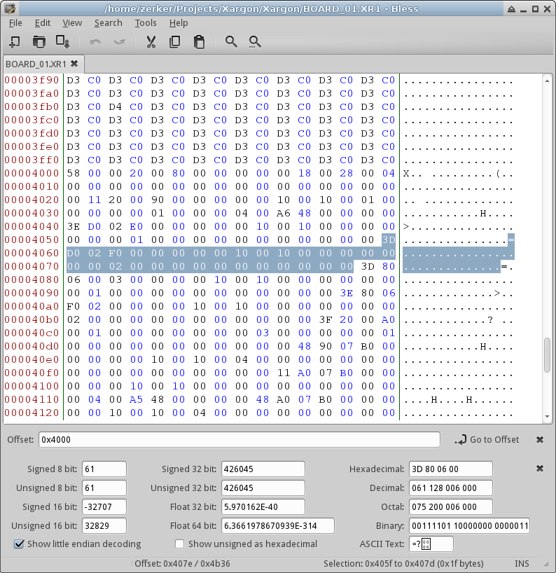
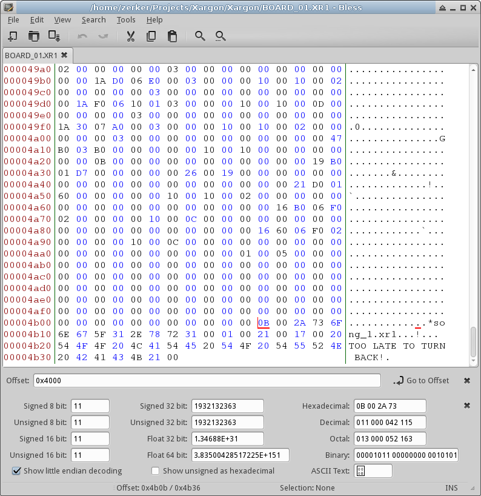

# Day 7 #

Hello and welcome back. Today we will be looking at the rest of the map 
format. We're looking for two major things to include in our map:

1) Some sort of header information that will hopefully give us more 
   information on background colours
2) Monsters and Pickups!

Remember the garbage at the bottom of this image?


Well, let's try to figure out what it means. There's obviously a 
repeating pattern here, but it's a bit skewed because we were decoding 
two bytes at a time. From the image, it looks about 15-16 pixels, or 
probably 31 bytes in length. Let's see if we can find the bounds of 
this record in a hex editor. The map is 128*64*2 bytes long, so we 
should start at offset 0x4000.



Looks about right. But now we need to find the bounds of this region, 
and to figure out what comes before and after it. Let's start at the 
end of the file instead.



Well, that's very clearly delineated. There is a number followed by a 
string then the next string, etc. The number appears to be the string 
length. The previous section also has a clear empty buffer region 
between, so I'm going to assume that the last record ends with a 
non-zero number. If I then grab the last record, it looks like:

    F0 02 00 00 00 00 10 00 0C 00 00 00 00 00 00 00 00 00 00 00 00 00 00 00 00 00 00 00 01 00 05

That seems like a fairly likely record alignment. The first two 
characters correspond to a 16 number of 752, which is a reasonable 
decoding. The F0 is at offset 0x4A8E, so let's keep going back in 
intervals of 31 until we reach a reasonable first record. (0x4000 - 
0x4A8E) / 0x57.29, so it looks like we have approximately 0x57 (87) 
records here. My first guess places the start of these records at 
address 0x4005.

Lining up the first few records:

```
80 00 00 00 00 00 18 00 28 00 04 00 00 00 00 00 00 00 00 00 00 00 00 00 00 00 00 00 11 20 00
90 00 00 00 00 00 10 00 10 00 01 00 00 00 00 00 01 00 00 00 04 00 A6 48 00 00 00 00 3E D0 02
E0 00 00 00 00 00 10 00 10 00 00 00 00 00 00 00 01 00 00 00 00 00 00 00 00 00 00 00 3D D0 02
F0 00 00 00 00 00 10 00 10 00 00 00 00 00 00 00 02 00 00 00 00 00 00 00 00 00 00 00 3D 80 06
00 03 00 00 00 00 10 00 10 00 00 00 00 00 00 00 01 00 00 00 00 00 00 00 00 00 00 00 3E 80 06
F0 02 00 00 00 00 10 00 10 00 00 00 00 00 00 00 02 00 00 00 00 00 00 00 00 00 00 00 3F 20 00
```

Looks right to me. That means we have 5 unique bytes:

    58 00 00 20 00

0x58 = 88, which appears to be the number of records we have. That 
leaves us with 0x20 (i.e. 32). Let's look at the headers for a couple 
different stages set together:

```
58 00 00 20 00
58 00 00 20 00
6C 00 00 30 00
AD 00 00 B0 03
B6 00 00 30 00
85 00 00 B0 01
A1 00 00 90 00
B6 00 00 E0 01
9A 00 00 40 07
A1 00 00 90 00
B5 00 00 80 00
2E 00 00 30 07
70 00 00 30 02
```

Well, I can't figure out a correlation right now, but I think this is a 16 bit number.

Let's assign bit decoding characters for the repeating record. I'm 
going to grab a few more examples just to get a clearer picture. This 
may be incorrect, but we need to start with something:

```
H     H     H     H     H     H     H     H     H     H     H     B  B  H     H     B  H
80 00 00 00 00 00 18 00 28 00 04 00 00 00 00 00 00 00 00 00 00 00 00 00 00 00 00 00 11 20 00
90 00 00 00 00 00 10 00 10 00 01 00 00 00 00 00 01 00 00 00 04 00 A6 48 00 00 00 00 3E D0 02
E0 00 00 00 00 00 10 00 10 00 00 00 00 00 00 00 01 00 00 00 00 00 00 00 00 00 00 00 3D D0 02
F0 00 00 00 00 00 10 00 10 00 00 00 00 00 00 00 02 00 00 00 00 00 00 00 00 00 00 00 3D 80 06
00 03 00 00 00 00 10 00 10 00 00 00 00 00 00 00 01 00 00 00 00 00 00 00 00 00 00 00 3E 80 06
F0 02 00 00 00 00 10 00 10 00 00 00 00 00 00 00 02 00 00 00 00 00 00 00 00 00 00 00 3F 20 00
A0 00 01 00 00 00 00 00 00 00 03 00 00 00 00 00 01 00 00 00 00 00 00 00 00 00 00 00 48 90 07
B0 00 00 00 00 00 10 00 10 00 04 00 00 00 00 00 00 00 00 00 00 00 00 00 00 00 00 00 11 A0 07
B0 00 00 00 00 00 10 00 10 00 00 00 00 00 00 00 00 00 00 00 04 00 A5 48 00 00 00 00 48 A0 07
B0 00 00 00 00 00 10 00 10 00 04 00 00 00 00 00 00 00 00 00 00 00 00 00 00 00 00 00 21 40 07
A0 01 00 00 00 00 10 00 10 00 02 00 00 00 00 00 00 00 00 00 00 00 00 00 00 00 00 00 21 50 07
90 01 00 00 00 00 10 00 10 00 02 00 00 00 00 00 00 00 00 00 00 00 00 00 00 00 00 00 21 60 07
```

Or, condensed, '<11H2B2HBH'. Time to update our map script to decode 
this information and write it out to a debug CSV so we can hopefully 
figure something useful out of it (like an object ID and coordinates).

```py
class xargonmap(object):
    def __init__(self, filename):
        # Grab the map from the file name (sans ext)
        (temppath, tempfname) = os.path.split(filename)
        (self.name, tempext) = os.path.splitext(tempfname)

        # Load the map data as a 64*128 array of 16 bit values:
        mapfile = open(filename, 'rb')
        pattern = '<{}H'.format(64*128)

        self.tiles = struct.unpack(pattern,
            mapfile.read(struct.calcsize(pattern)) )

        # Decode the object header then the object list
        objheader = '<HBH'
        objrecord = '<11H2B2HBH'

        (numobjs, blank, self.unknown) = struct.unpack(objheader,
            mapfile.read(struct.calcsize(objheader)) )

        self.objs = [struct.unpack(objrecord,
            mapfile.read(struct.calcsize(objrecord)) )
            for i in range(numobjs)]

        # There always appears to be a 0x5E spacer region
        mapfile.read(0x5E)

        # Capture any strings until the end of the file
        self.strings = []
        sizebytes = mapfile.read(2)
        while (len(sizebytes) == 2):
            (stringlen,) = struct.unpack('<H', sizebytes)
            self.strings.append(mapfile.read(stringlen))
            mapfile.read(1)
            sizebytes = mapfile.read(2)

        mapfile.close()


    def debugcsv(self):
        # Remember that the map is height-first. We need to convert to
        # width-first. This only outputs tile data for now.
        with open(self.name + '.csv', 'wb') as csvfile:
            writer = csv.writer(csvfile)
            for y in range(64):
                writer.writerow([self.tiles[x*64+y] for x in range(128)])

        # Next, output the object list:
        with open(self.name + '_objs.csv', 'wb') as csvfile:
            writer = csv.writer(csvfile)
            writer.writerows(self.objs)

        # Finally, the header and strings list:
        with open(self.name + '_info.csv', 'wb') as csvfile:
            writer = csv.writer(csvfile)
            writer.writerow([self.unknown] + self.strings)
```

And a subset of the object csv output:

```
176 0   0       16  16  4   0   0   0   0   0   0   0   0   0   17  1952
176 0   0       16  16  0   0   0   0   0   4   165 72  0   0   72  1952
176 0   0       16  16  4   0   0   0   0   0   0   0   0   0   33  1856
416 0   0       16  16  2   0   0   0   0   0   0   0   0   0   33  1872
400 0   0       16  16  2   0   0   0   0   0   0   0   0   0   33  1888
400 0   0       16  16  2   0   0   0   0   0   0   0   0   0   33  1904
416 0   0       16  16  2   0   0   0   0   0   0   0   0   0   21  1936
240 0   0       16  16  0   0   0   0   0   0   0   0   0   0   7   1584
788 9   65535   184 8   0   0   0   0   0   4   55  68  0   0   22  1584
752 0   0       16  12  0   0   0   0   0   0   0   0   0   0   22  1600
736 0   0       16  12  0   0   0   0   0   0   0   0   0   0   22  1600
704 0   0       16  12  0   0   0   0   0   0   0   0   0   0   22  1584
720 0   0       16  12  0   0   0   0   0   0   0   0   0   0   22  1744
704 0   0       16  12  0   0   0   0   0   0   0   0   0   0   22  1760
720 0   0       16  12  0   0   0   0   0   0   0   0   0   0   22  1744
736 0   0       16  12  0   0   0   0   0   0   0   0   0   0   22  1760
752 0   0       16  12  0   0   0   0   0   0   0   0   0   0   21  1440
464 0   0       16  16  0   0   0   0   0   0   0   0   0   0   72  1936
160 0   0       32  16  11  0   0   0   0   0   0   0   0   0   51  160
128 1   0       80  16  0   0   0   0   0   0   0   0   0   0   51  1824
```

Well, whatever is in that 65535's column, it is probably signed. 
However, it's unlikely that data will be relevant for us (since it's 
normally zero). We need to pick out likely coordinate and item ID 
columns. The easiest way to do this is to locate a known object (or 
pattern of objects) in the game world and try to find their 
representation.

This classic screenshot provides some useful objects. All of the same 
type in close proximity:


Opening up the pixelmap image in GIMP, drawing in the item locations, 
then checking their coordinates results in the following zero-based 
indicies:

    (3, 11) (3, 12) (2, 13) (4, 13)

1-based:

    (4, 12) (4, 13) (3, 14) (5, 14)

And I'm coming up pretty empty. I'm not even sure what could look like 
coordinates or an index in the data I have. Nothing is obviously a 
coordinate system, and a direct index would require a number between 0 
and 8192, and nothing goes anywhere near this value. But I have a 
strange idea that the indicies could possibly be given in absolute 
pixel coordinates. Let's divide the first and last columns by 16 and 
see if we see any patterns.

And.... (drum roll):

```
176 0   0   16  16  0   0   0   0   0   0   0   0   0   0   33  32 | 11  2
208 0   0   16  16  5   0   0   0   0   0   0   0   0   0   33  48 | 13  3
176 0   0   16  16  5   0   0   0   0   0   0   0   0   0   33  64 | 11  4
208 0   0   16  16  5   0   0   0   0   0   0   0   0   0   33  48 | 13  3
```

Hrm, not a perfect match, but close. Also, every entry appears to be 
within the bounds for a 64 x 128 map, and appears sane. I'm not going 
to implement today, but I have a theoretical decoding. I will number 
the columns below:

```
1   2   3   4   5   6   7   8   9   10  11  12  13  14  15  16  17
176 0   0   16  16  0   0   0   0   0   0   0   0   0   0   33  32 | 11  2
208 0   0   16  16  5   0   0   0   0   0   0   0   0   0   33  48 | 13  3
176 0   0   16  16  5   0   0   0   0   0   0   0   0   0   33  64 | 11  4
208 0   0   16  16  5   0   0   0   0   0   0   0   0   0   33  48 | 13  3
```

Column 1: Y coordinate * 16  
Column 17: X coordinate * 16  
Columns 4 and 5: Nominal sprite dimensions  
Column 16: Sprite type

And a few tenative identifications:

17 : Player Start  
25: Wandering Monster thing  
33 : Lolly Pop pickup

The nominal sprite dimensions entry I guessed because I noticed the 
coordinates 2, 8 would put something pretty close to the start of the 
level and the dimensions were 24, 40 (same as the player sprite). Also, 
the first-level monster sprite dimensions are 38, 25, which shows up 
several times in this file.

[day7.zip][day7] is available for anyone who wants it.

[day7]: http://www.zerker.ca/misc/xargon/day7.zip
