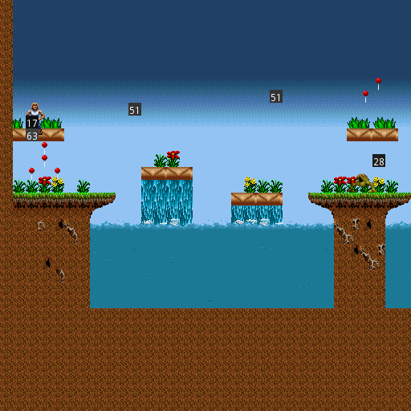
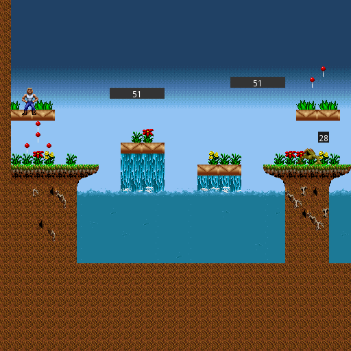
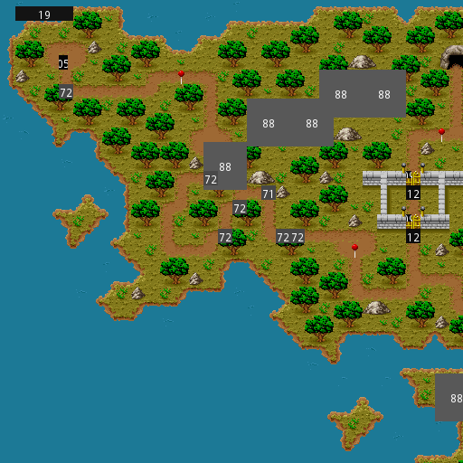

# Day 8 #

Looking at the decoding from yesterday again, I think I misaligned the 
record start after all. I think the ``20 00`` at the start of the record 
area is actually the X coordinate for the first record. That means that 
the trailing number of 05 is its own thing. Let's move that around and 
see if that fixes our "almost correct" alignment for the pickups at the 
start. Remember, we expected either

0-based:

    (3, 11) (3, 12) (2, 13) (4, 13)

or 1-based:

    (4, 12) (4, 13) (3, 14) (5, 14)

And we get:
```
32  208 0   0   16  16  5   0   0   0   0   0   0   0   0   0   33  2   13
48  176 0   0   16  16  5   0   0   0   0   0   0   0   0   0   33  3   11
64  208 0   0   16  16  5   0   0   0   0   0   0   0   0   0   33  4   13
48  192 0   0   16  16  5   0   0   0   0   0   0   0   0   0   59  3   12
```

Coordinates match up, but the item ID is off for the last one. Looks 
like we are off by TWO fields. Let's fix that again and get:

```
33  32  208 0   0   16  16  5   0   0   0   0   0   0   0   0   0   2   13
33  48  176 0   0   16  16  5   0   0   0   0   0   0   0   0   0   3   11
33  64  208 0   0   16  16  5   0   0   0   0   0   0   0   0   0   4   13
33  48  192 0   0   16  16  5   0   0   0   0   0   0   0   0   0   3   12
```

I also switched the half-words to signed due to the strange 65535 
entries. Nothing appears to "normally" approach the 16 bit boundary, so 
this should be safe. I also changed how I skip/capture the apparently 
unused map region. Hopefully I can find a pattern for the maps with 
different background colours, when I get there. Here's the updated 

```py
# Decode the object header then the object list
objrecord = '<B12h2B2H'

(numobjs,) = struct.unpack('<H', mapfile.read(2) )

self.objs = [struct.unpack(objrecord,
    mapfile.read(struct.calcsize(objrecord)) )
    for i in range(numobjs)]

# There always appears to be a 0x61 byte unknown region between
# the records and strings. Let's just collect it as bytes for now.
unknownregion = '<97B'
self.unknown = struct.unpack(unknownregion,
    mapfile.read(struct.calcsize(unknownregion)) )
```

Okay, now we think we have a reasonable decoding, and a few sample 
mappings (corrected due to the misalignment):

0 - Player start  
33 - Lolly Pop  
25 - Monster

Unfortunately, pickup/monster/object sprites are typically defined in 
code due the additional logic that is typically needed. It's unlikely 
we will find a direct mapping like we did for the Tiles. That said, 
there usually isn't an overwhelming number of interactable objects in a 
game, so we should be able to identify them as-we-go. We know there 
aren't more than 256 of them, after all. In order to track the 
mappings, we should start a new Python file for the sprite database. 
This will contain a lookup table for record entries, and a method to 
grab the correct sprite for a given sprite ID. We will also re-use the 
debug code from unknown tiles to provide placeholders for unknown 
sprites.

Finally, we need to make a decision on how sprites get drawn into the 
world. There are two options: have the mapper handle everything and add 
additional logic there, or defer processing to the sprite file, and 
pass in a reference to the map-in-progress. I'm going to choose the 
later, because it helps keep all the sprite processing in one place. 
Here's the first cut at the sprite file:

```py
lookup = {  0: (6, 9),
           25: (35, 2),
           33: (37, 5)
         }

def drawsprite(mappicture, graphics, spriterecord):
    (spriteid, x, y) = spriterecord[0:3]
    (width, height) = spriterecord[5:7]

    if spriteid in lookup:
        (recnum, imagenum) = lookup[spriteid]
        spriteimage = graphics.records[recnum].images[imagenum]
    else:
        spriteimage = graphics.unknown[spriteid]

    # When pasting masked images, need to specify the mask for the paste.
    # RGBA images can be used as their own masks.
    mappicture.paste(spriteimage, (x, y), spriteimage)
```

And the addition to the mapper:

```py
for objrecord in mapdata.objs:
    spritedb.drawsprite(self.mappicture, graphics, objrecord)
```



Looking good. A couple things to note that we will need to take care 
of:

1) There are some objects that appear functional but not visual in 
   nature (object IDs 17 and 63). We could provide markup to indicate what 
   we think they mean, but I think a better approach would be to simply 
   not draw anything.

2) The player start appears slightly in the ground. We will either need 
   to figure out an alignment algorithm to correct this sort of thing, or 
   make a special case for the player sprite.

3) The sprites have Dimensions. We should take this into account for 
   our debug images to make them easier to identify by shape as well as 
   location.

To make this sort of thing easier, I'm going to expand our spritedb 
file into an actual class which will keep a copy of the corresponding 
sprite images. This way it can generate debug images on-the-fly when a 
sprite is not found, and we can make specific entries for empty 
sprites. To consolidate functionality, I made the debug image function 
return empty sprites if called with 0 width and height.

```py
class spritedb(object):
    def __init__(self, graphics):
        self.sprites = {}

        # Simple sprite mapping:
        for (spriteid, recnum, imagenum) in [(0, 6, 9), (25, 35, 2),
                (33, 37, 5)]:
            self.sprites[spriteid] = graphics.records[recnum].images[imagenum]

        # Empty sprites:
        # For future reference, possible meanings are:
        # 17: Respawn point
        # 63: Start??
        for spriteid in [17, 63]:
            self.sprites[spriteid] = graphics.debugimage(spriteid, 0, 0)

        # Cache a reference to the graphics object for future use
        self.graphics = graphics

    def drawsprite(self, mappicture, spriterecord):
        (spriteid, x, y) = spriterecord[0:3]
        (width, height) = spriterecord[5:7]

        if spriteid not in self.sprites:
            self.sprites[spriteid] = self.graphics.debugimage(spriteid, width, height)

        # When pasting masked images, need to specify the mask for the paste.
        # RGBA images can be used as their own masks.
        mappicture.paste(self.sprites[spriteid], (x, y), self.sprites[spriteid])
```

Updated debug image function:

```py
def debugimage(index, width, height):
    """ Creates a debug image for sprites """
    if width > 0 and height > 0:
        colour = (index, index, index)
        tempimage = Image.new("RGBA", (width, height), colour)
        textcolor = (255, 255, 255) if index < 96 else (0, 0, 0)
        pen = ImageDraw.Draw(tempimage)
        pen.text((width/2 - 7, height/2 - 6), '{:02}'.format(index),
            font=imagefile.debugfont, fill=textcolor)
        return tempimage
    else:
        # 1 pixel transparent image
        return Image.new("RGBA", (width, height))
```



And now, we get to identifying. Time to fire up DosBox. Those 51 
sprites look like movable clouds, so I'll go find their sprite first. 
Once I get in-game, I'm going to go ahead and start identifying world 
map sprites too.

Hrm, it actually looks like the map goes by different sprite IDs!



That's fine, we can maintain two lookups. I'm going to go ahead and 
split it, then identify a few sprites. Then again, that doesn't look to 
be enough info. For instance, the 88 sprites on the map screen appear 
to be mountains, but mountains have two sides. I think there is some 
sort of sub-ID going on here. And I think I found it:

```
88  288     112 0   0   48  53  2   0   0   0   0   0   0   0   0   0
88  336     112 0   0   48  53  3   0   0   0   0   0   0   0   0   0
88  1232    592 0   0   48  53  6   0   0   0   0   0   0   0   0   0
88  768     112 0   0   48  53  2   0   0   0   0   0   0   0   0   0
88  816     112 0   0   48  53  3   0   0   0   0   0   0   0   0   0
88  976     176 0   0   48  53  0   0   0   0   0   0   0   0   0   0
88  1024    176 0   0   48  53  1   0   0   0   0   0   0   0   0   0
```

I think it's that column that counts 2, 3, 6, 2, 3, 0, 1. Next I'm 
going to need to expand the sprite identification to take that into 
account. But that's a task for tomorrow. I'll also need to figure out 
some way to clearly indicate the sub ID in the debug image. I may need 
to move back to 8 point font. 🙂️

[day8.zip][day8] is available for anyone who wants it.

[day8]: http://www.zerker.ca/misc/xargon/day8.zip
