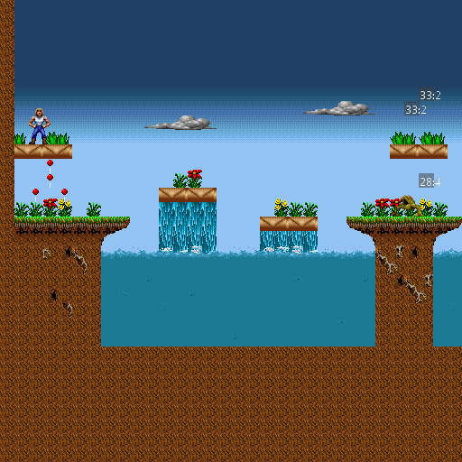
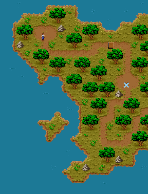
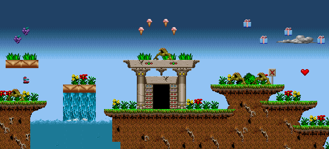
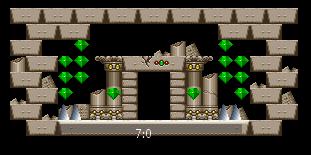

# Day 9 #

Hello folks. Let's get things restructured to allow item varients. I'm 
also going to introduce two new classes to make things more flexable: 
an object record class so I don't need to manually specify decoding 
every time, and a sprite class. The sprite class will be used to allow 
custom handling for certain sprites, like the player sprite (which 
needs an offset).

The objrecord class gets added to the xargonmap file:

```py
class objrecord(object):
    def __init__(self, record):
        self.rawdata = record
        (self.sprtype, self.x, self.y) = record[0:3]
        (self.width, self.height, self.subtype) = record[5:8]
```

With minor changes to init and debug output methods to compensate.

Next we need to update our sprite db and graphics file (i.e. debug 
image) to support the two identifiers. Let's do the debug image first. 
Note that I'm changing this to draw a slightly larger image if needed, 
and make the image rectangle semi-transparent. I also stopped bothering 
to pick different shades of gray.

```py
@staticmethod
def debugimage(index, subindex, width, height):
    """ Creates a debug image for sprites """
    if width > 0 and height > 0:
        # Provide sufficient space to display text
        imgwidth = max(width, 32)
        imgheight = max(height, 16)
        tempimage = Image.new("RGBA", (imgwidth, imgheight))
        pen = ImageDraw.Draw(tempimage)
        pen.rectangle(((0, 0), (width, height)), fill=(64, 64, 64, 128))
        pen.text((imgwidth/2 - 15, imgheight/2 - 6), '{}:{}'.format(index,subindex),
            font=imagefile.debugfont, fill=(255,255,255))
        return tempimage
    else:
        # 1 pixel transparent image
        return Image.new("RGBA", (width, height))
```

And the spritedb changes for both the two identifiers, and the 
dedicated sprite class. I also get rid of the two record structures, 
since that appears to be (another) misinterpretation.

```py
class spritedb(object):
    def addsprite(self, sprtype, subtype, sprite):
        if sprtype not in self.sprites:
            self.sprites[sprtype] = {}
        self.sprites[sprtype][subtype] = sprite

    def __init__(self, graphics):
        self.sprites = {}
        self.mapsprites = {}

        # Manually-defined sprites (i.e. special handling needed
        self.addsprite(0, 4, sprite(graphics.records[6].images[9], yoffs=-8))

        # Simple sprite mapping. Stage sprites, then Map sprites
        for (sprtype, subtype, recnum, imagenum) in [(25, 0, 35, 2), # Monsters
                (33, 5, 37, 5), # Pickups
                (51, 0, 36, 33), # Clouds
                (5, 0, 47, 8)]: # Map Player
            self.addsprite(sprtype, subtype, sprite(graphics.records[recnum].images[imagenum]))

        # Empty sprites:
        # For future reference, possible meanings are:
        # 17-1: Respawn point
        # 63-3: Start??
        for sprtype, subtype in [(17,1), (63,3), (19,0)]:
            self.addsprite(sprtype, subtype, sprite(graphics.debugimage(sprtype, subtype, 0, 0)))

        # Cache a reference to the graphics object for future use
        self.graphics = graphics

    def drawsprite(self, mappicture, objrec):
        if objrec.sprtype not in self.sprites or \
                objrec.subtype not in self.sprites[objrec.sprtype]:
            self.addsprite(objrec.sprtype, objrec.subtype, sprite(
                self.graphics.debugimage(objrec.sprtype, objrec.subtype,
                objrec.width, objrec.height)))

        self.sprites[objrec.sprtype][objrec.subtype].draw(mappicture, objrec)

class sprite(object):
    def __init__(self, image, xoffs=0, yoffs=0):
        self.image = image
        self.xoffs = xoffs
        self.yoffs = yoffs

    def draw(self, mappicture, objrec):
        # When pasting masked images, need to specify the mask for the paste.
        # RGBA images can be used as their own masks.
        mappicture.paste(self.image, (objrec.x +self.xoffs,
            objrec.y +self.yoffs), self.image)
```



Excellent. Now it's time to ACTUALLY get decoding things, since we 
won't end up with overlapping definitions any more. Things a pretty 
straightforward at this point. Here's the properly identified first 
section of the map:



And a bit further into level 1:



But it looks like our interior room has a special sprite for the 
in-game text.



That's going to require something special to implement. Also, we're 
going to want to indicate what is INSIDE a present, since we can decode 
that information. That too, will require special handling. With the 
architecture we have now, we can simply set up subclasses of the sprite 
class to draw more complicated information. Unfortunately, we're out of 
time for today, so that will have to be tomorrow.

[day9.zip][day9] is available.

[day9]: http://www.zerker.ca/misc/xargon/day9.zip
